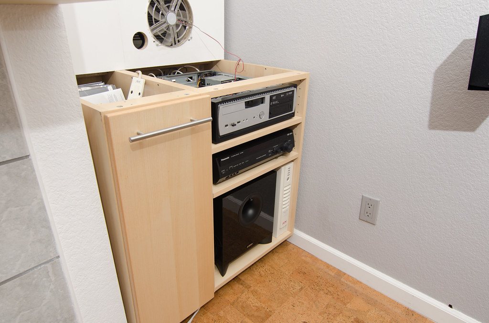
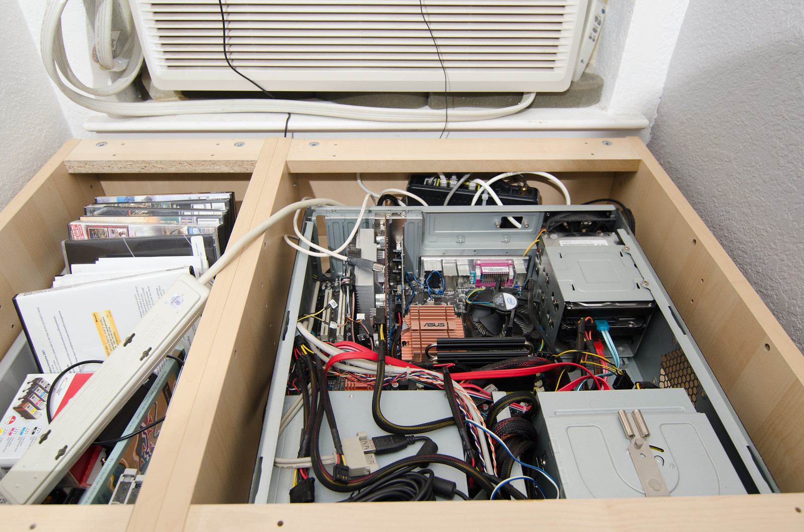

# Rationale

At home the (only) "desktop" I use is an HTPC.  Noisy at that, because of the
need to keep and cool large storage for media playback and editing.  I wonder
whether something could be done.  Main requirements are performance, ease of
use, reliability and ease of growth. Copying between internal SATA HDs is being
done at about 70-100MB/s.  This sets performance goal.

Reliability is now achieved by keeping multiple backup HDs.  The backup copies
are frequently obsolete, but you can't beat the simplicity of sticking a bare
HD into a docking station (the HTPC needs to be off) and launching a synctoy.
Growth is straightforward.  Every other year I buy a new HD, copy media to it,
replace the media HD in the HTPC with a new one and relegate an old one to
backup duties.

For a couple of years I was running a Linux box (I don't think term NAS was
widely used then) with a software RAID5.  I verified a procedure (based on
mdadm) to introduce new hard drives followed by volume expansion.  But boy,
every time the thing would boot, watching it fschk'ing the drives was nerve
wracking.  And write performance was underwhelming to say the least.

Originally
[published here](https://nasfuss.blogspot.com/2012/03/rationale.html).
