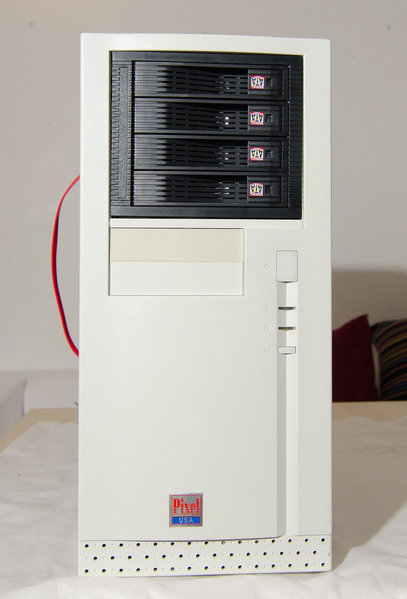
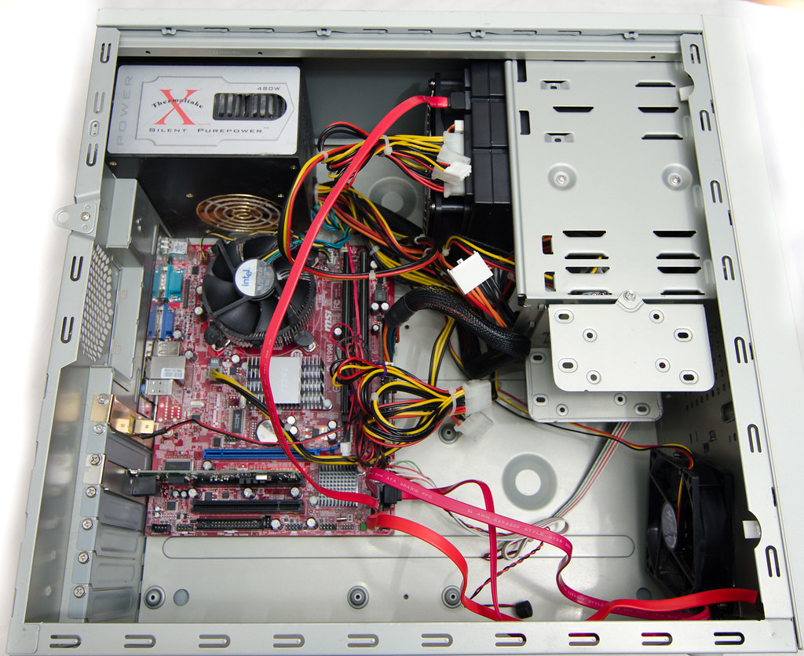

Here is an old desktop, once built for my parents to surf internet and look at their grandchildren pictures.

  

Part|Details
----|-------
CPU|Intel Core 2 Duo 65nm E4300 Allendale 1.8GHz 800MHz FSB LGA 775 65W
Motherboard|[MSI G31TM-P21 LGA 775 Intel G31 Micro ATX](http://www.newegg.com/Product/Product.aspx?Item=N82E16813130234).  Onboard video, 4x SATA ports on ICH7.

It is now souped up.  RAM is [maxed out to 8MB](http://www.newegg.com/Product/Product.aspx?Item=N82E16813130234).
New [hard drive cage](http://www.newegg.com/Product/Product.aspx?Item=N82E16813130234)
is installed. It proved to be loud enough to do something about it.  Just
disconnecting the cage fan results in HD temps raising to 50C within an hour,
and that's with just 2 of them installed.  Placed an order for a fan
controller - hope that will help.  The cage is also designed so that the
connectors - all of them - are on the farther side so that after installation
none of these are accessible in my case.  Hence I installed it upside down.

Network is upgraded to a [switched 1Gbit](https://www.amazon.com/gp/product/B001QUA6R0?th=1).
HTPC and a NAS box are old enough to require a NIC upgrade.
I hope for the NAS to boot from flash and got a
[PATA to flash adapter](http://www.amazon.com/gp/product/B000YUMLPI/).
Making this work on Solaris 11 (and even booting from it!) seems like a long
shot though.

    

Originally
[published here](https://nasfuss.blogspot.com/2012/03/hardware.html).
