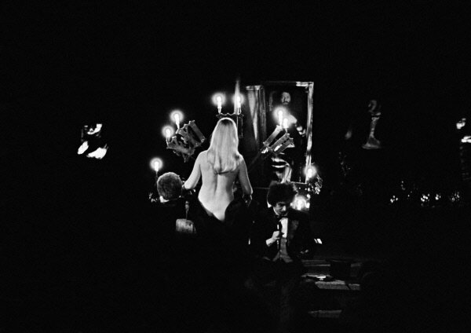

Entrance exams to [Fizteh](http://en.wikipedia.org/wiki/Moscow_Institute_of_Physics_and_Technology) were scheduled for July, well ahead of most other institutions in Russia, so that those who fail still had a chance at other schools.  That year it also coincided with [Moscow Olympic Games](https://en.wikipedia.org/wiki/1980_Summer_Olympics).  Therefore the city was cleared of most domestic tourists.  I was offered a cot in a gym for a nominal price.  I was applying with my friend (Yuri Semenov) who was trying to enter Fizteh for the second time and knew his way around the campus.  Sergey Ostashko, my former teacher of physics, Fizteh dropout  and a friend flew in to support me.

This is Sergey who took me to Hamlet at [Taganka](http://en.wikipedia.org/wiki/Taganka_Theatre) on July 18, 1980.  There was no way in hell we would get tickets - people were “shooting” for an extra one all the way down from the metro platform.  And we certainly could not afford the price foreigners were paying.  Sergey thought he had a chance so we spent half an hour waiting for his acquaintances at the back entrance.  It was interesting to see famous actors - I think I saw [Demidova](http://en.wikipedia.org/wiki/Alla_Demidova) - they appeared to be nice and smiled to their fans, of which I remember very few.  I never saw [Vysotsky](http://en.wikipedia.org/wiki/Vladimir_Vysotsky).  We never got the tickets then.  I never believed we would so was not disappointed much.  This proved to be the last Vysotsky’s performance - he died a week later.  I remember being crushed by the news of his death.

I got accepted to Fizteh.  Yuri was not.  He tried one more time a year later and failed again.

There were two ways to get theater and concert tickets for Fizteh students.  Despite being affordable (rather because of this) tickets would go on sale and be sold off within minutes.  First tickets would be sold to veterans of the WW2.  Then they were sold to the crowd which by that time would be waiting for hours.  That’s where we would come in.  It was called “snos” - I would translate it as “torrent”.  A band from Fizteh - remember we had no girls to speak off - so this was an all-male band of few dozen to a hundred - would occupy all approaches to a box office and stand overnight till the opening.  Sometimes we were challenged by other colleges.  Fights for Sovremennik theater tickets were most interesting because of the tactical challenges - there was a portico which made defence perimeter too big and easy to penetrate by the attacking band - they would just through attackers over the defenders’ heads.

I did not like “snosy” much.  Mostly because there was a second way to get theater tickets, specifically to Taganka, the coolest theater in Moscow, and only for Fizteh students.  See, somehow theater management liked Fizteh, and agreed to allow for us to work there.  One day of work and you get a get a couple of tickets!

The first play I’ve seen was [Ten Days that Shook the World](http://vimeo.com/28358083).  Even before the play began actors (is this really [Zolotuhin](http://en.wikipedia.org/wiki/Valeri_Zolotukhin)?  It is!) were mixing with the crowds and singing revolutionary songs.  The flow of energy was tremendous.  The immediacy of action incomparable.  The fact that the scene had no props made no difference.  I was sold.  Totally and utterly. On the spot.

Taganka was my first true love.  I poured concrete into foundation of the new building.  I cleaned rooms.  I drove across the city to bring supplies and food for the buffet.  In a little while I did not need tickets.  And this is how I got to the ultimate most famous and most amazing performance of [Master and Margarita](http://en.wikipedia.org/wiki/The_Master_and_Margarita).  It was June 1982 and I had a final exam in general military training tomorrow.  I was totally confident and invited my school friend to join me for some light work, study and entertainment.  I do not remember what we were doing that day at the theater.  At around 3pm we locked ourselves in a 1-toilet bathroom under the roof of the building.  Then we spent there 3 hours studying our notes for tomorrow exam taking turns to check each others progress,  M16 assault rifle - bullet velocity and effective range.  Tank Leopard - weight and speed.  Organization of the motorized rifle company of the Soviet Army.  All such nonsense.  At 6:15 it was time to act.  I led us down to the foyer.  An administrator saw and could have easily caught us.  But he never bothered - he knew who we were and knew exactly what we were doing.  I just loved that place.  The next step was to be near the doors to the balcony when these were opened.  A short sprint and we were standing firm in the first row - the best place to see the performance.  I knew for a fact that they never kick out people from here.  And if those occupying an aisle seat are nice enough, I could sit on the arm of their chair.  So I placed my feet wide, grabbed my friend by the belt to ensure he is not carried away and was ready to withstand the crowd around me and to stand still for the next 3 hours.  I remember clearly that the aisle seat was then taken by a big fat guy and I without hesitation just leaned on his shoulder.  After the first act my neighbor decided to offer me his wife.  The smart guy knew I could not treat her the way I treated him, and swapped seats with her.  Then I had to just stand on my own.

The play was fantastic!  I was totally high.  It was a pure joy of acting.  The scene was occupied by a single wooden beam with some fabric hanging from it.  Hung from the ceiling it was a barrier or wall or road or it would spin to waltz music.  Nothing else for props.  And what acting!  And of course the scene which we all waited for - Margarita presiding at the ball sitting with her back to the audience.  Naked.  [Shatskaya](https://en.wikipedia.org/wiki/Nina_Shatskaya_(actress)).

I do not remember the road back to the dorm.  In my ears all I heard was Begemot’s (a cat from the devil’s entourage) “Мы в восхищении!”.  “We are delighted!”

Back in the dorm I decided that a proper way to complete the night would be to reread the novel - right there and then - I should be able to tell my kids I had at least one sleepless night before an exam.  That I did.  I still remember that morning, getting a cold water shave at the barber’s.  Exam I do not remember at all.
