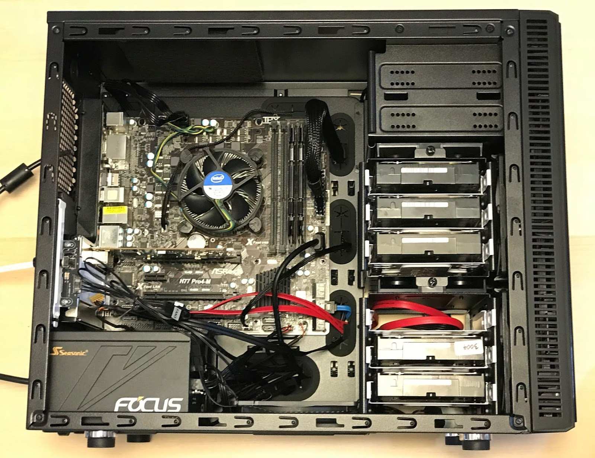

# Big Reshuffle

Those attempts to run VirtualBox on nas4free were a real nice try.  But now I want to have a dedicated VM server.  So I decided... to build a new NAS box.  In its previous life NASA (as it will be called) used to be my HTPC.  In this new incarnation it will get a better Ethernet and SATA adapter.   New NASA box will be:

* smaller on the outside, yet bigger on the inside
* run nas4free
* will serve disks to a separate VM server - we shall name it Hyperion
* Hyperion will be built out of part of the old NAS box

Here is the current spec for NASA:

Part|Description
----|-----------
CPU|Intel Core i3-3225 Ivy Bridge 3.3 GHz 55W LGA1155
Motherboard|ASRock H77 Pro4-M mATX
RAM|Team 8GB (2 x 4GB) 240-Pin DDR3 1600 (PC3 12800) 9-9-9-24 1.5V
HBA|HighPoint Rocket 640L 4-Port PCI-Express 2.0 x4 SATA 6Gb/s
Ethernet|Dell Intel I350-T2 Dual Port 1GBE Network Card XP0NY
Video|Intel HD4000
PSU|Seasonic FOCUS 450 Gold SSR-450FM 450W 80+ Gold ATX12V & EPS12V 140mm
Case|Fractal Design Define Mini Black Silent mATX

The best part of the build is the case.  It is awesome.  The details, such as dampening material on the cover, HD cage, provisions for cable  management are fantastic.

Intel Ethernet NIC is a top notch and provides two channels!  I may even play
with LACP.

Motherboard has 2 SATA3 ports provided by Intel H77 chipset.  2 more SATA3 ports
are provided by on-board  ASMedia ASM1061 chipset - I decided against usint it.
H77 has 4 more SATA2 ports.  I thought those will not cut it.  I am
reconsidering.  a $20 HighPoint Rocket 640L uses Marvell 88SE9230 chipset and
the more I read about it the less confident I feel about running NAS on it.

nas4free immediately recognized all the hardware and I managed to build myself
a RAIDZ2 pool using 5 WD Reds.  Too bad I went cheap and bought used drives.
Two of them have to be replaced.  Already.

I will try to move HDs to SATA2 ports and if the box will be still able to
sustain 100MB/sec transfer rate (which I think it should) I will stick to
motherboard SATA only.

[original post](https://nasfuss.blogspot.com/2018/06/big-reshuffle.html)
