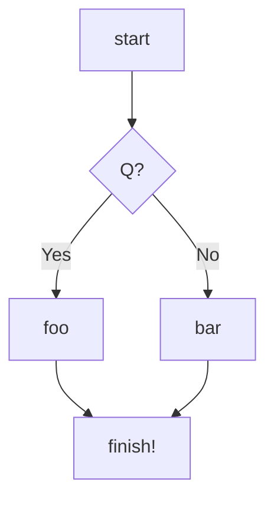
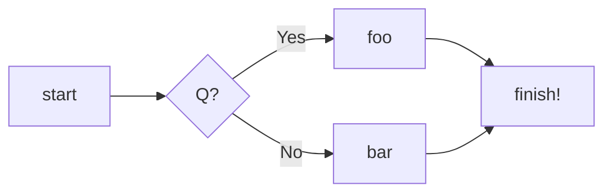

[Mermaid](https://mermaid-js.github.io) is [now on
github](https://github.blog/2022-02-14-include-diagrams-markdown-files-mermaid/)!

Is this awesome or what?

Links:
* [Repository](https://github.com/mermaid-js/mermaid)
* [Editor](https://mermaid-js.github.io/mermaid-live-editor/)
