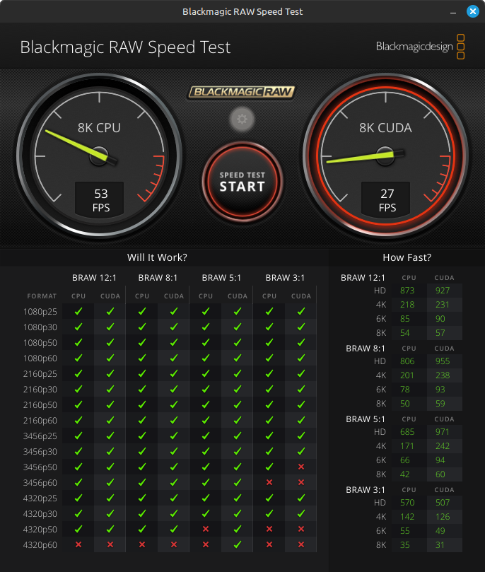

# DaVinci Resolve on Linux

## Install on Mint

Download from
[support page](https://www.blackmagicdesign.com/support/family/davinci-resolve-and-fusion).

Apparently
[Davinci Resolve is broken on anything Ubuntu 24.04 based right now](https://www.reddit.com/r/linuxmint/comments/1eljohq/mint_22_and_davinci_resolve/).

Sources of information:

* https://github.com/flolu/davinci-resolve-linux
* [DaVinci Resolve on Ubuntu 24.04 - the easy way](https://www.youtube.com/watch?v=FHnNqtAwJ6M)
* [with AMD graphics](https://forums.linuxmint.com/viewtopic.php?t=426123),

Resolution involves use of [distrorun](https://github.com/Shachar/distrorun)
and [drinstaller](https://github.com/Shachar/drinstaller).

1. Install drinstaller DEB file - this results in `shemesh.biz` being added as
a software source.
2. Install helper packages:
```
sudo apt update
sudo apt upgrade
sudo apt install drinstaller
```
3. Observe DaVinci Resolve menu appearing.
4. Install Rocky Linux by picking the item from the menu.
5. Install NVidia driver inside the container by picking an item from the menu.
6. Install DaVinci Resolve by picking an item from the menu.

```
Please provide path to DaVinci Resolve installer
'/home/alex/Downloads/DaVinci_Resolve_19.0.1_Linux.run'
distrorun --extra-volume=/usr/lib/udev/rules.d drrocky /home/alex/Downloads/DaVinci_Resolve_19.0.1_Linux.run
Root is "/srv/distros/drrocky"
Mounting "/dev" on "/srv/distros/drrocky/dev"
Mounting "/home" on "/srv/distros/drrocky/home"
Mounting "/run" on "/srv/distros/drrocky/run"
Mounting "/usr/share/fonts" on "/srv/distros/drrocky/usr/share/fonts"
Mounting "/tmp" on "/srv/distros/drrocky/tmp"
Mounting "/usr/lib/udev/rules.d" on "/srv/distros/drrocky/usr/lib/udev/rules.d"
Starting command /home/alex/Downloads/DaVinci_Resolve_19.0.1_Linux.run
Qt: Session management error: None of the authentication protocols specified are supported
QWizard::setField: No such field 'options.uninstall'
QWizard::field: No such field 'options.uninstall'
```

The installer:
```
The value for the SHELL variable was not found the /etc/shells file This incident has been reported.
```

7. I suspect thie above is due to my use of the zsh. To install the zsh in the
rocky container:

```
alex@exi > sudo distrorun drrocky /bin/bash
Root is "/srv/distros/drrocky"
Mounting "/dev" on "/srv/distros/drrocky/dev"
Mounting "/home" on "/srv/distros/drrocky/home"
Mounting "/run" on "/srv/distros/drrocky/run"
Mounting "/usr/share/fonts" on "/srv/distros/drrocky/usr/share/fonts"
Mounting "/tmp" on "/srv/distros/drrocky/tmp"
Starting command /bin/bash
[root@exi alex]#
[root@exi alex]# id
uid=0(root) gid=0(root) groups=0(root)
[root@exi alex]#
[root@exi alex]# dnf install zsh
...
Complete!
```

8.  Rerty 6.  This time it succeeds:

```
Please provide path to DaVinci Resolve installer
'/home/alex/Downloads/DaVinci_Resolve_19.0.1_Linux.run'
distrorun --extra-volume=/usr/lib/udev/rules.d drrocky /home/alex/Downloads/DaVinci_Resolve_19.0.1_Linux.run
Root is "/srv/distros/drrocky"
Mounting "/dev" on "/srv/distros/drrocky/dev"
Mounting "/home" on "/srv/distros/drrocky/home"
Mounting "/run" on "/srv/distros/drrocky/run"
Mounting "/usr/share/fonts" on "/srv/distros/drrocky/usr/share/fonts"
Mounting "/tmp" on "/srv/distros/drrocky/tmp"
Mounting "/usr/lib/udev/rules.d" on "/srv/distros/drrocky/usr/lib/udev/rules.d"
Starting command /home/alex/Downloads/DaVinci_Resolve_19.0.1_Linux.run
Qt: Session management error: None of the authentication protocols specified are supported
QWizard::setField: No such field 'options.uninstall'
QWizard::field: No such field 'options.uninstall'

Post BlackMagic setup adjustments
Refreshing udev rules

Installation done

Finished successfully
Press ENTER to close terminal
```

## Raw Speed Test



## Use

[keyboard shortcuts](./kb-shortcuts.txt)
