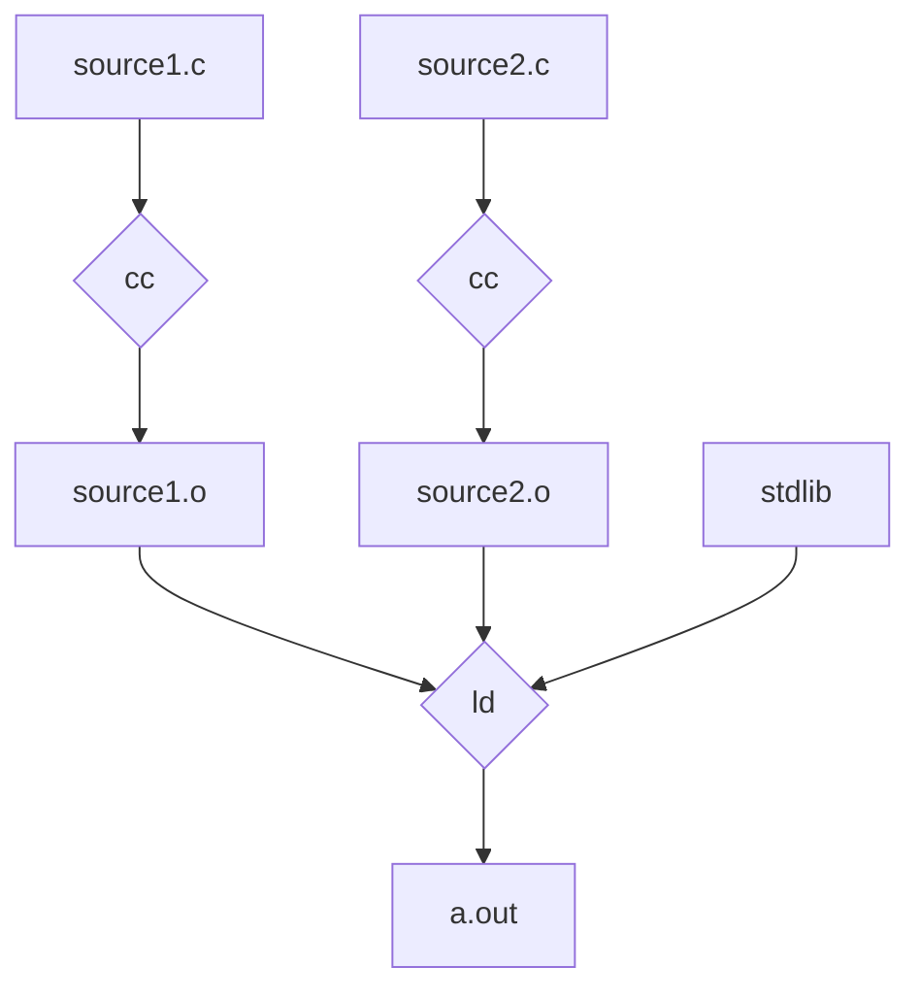

# make and Makefile

My definition: `make` is a data-driven (data is in a `Makefile`) filter for
building 'targets'.

GNU [man page](https://man7.org/linux/man-pages/man1/make.1.html),
[manual](https://www.gnu.org/software/make/manual/make.html),
[quick reference](https://www.gnu.org/software/make/manual/make.html#Quick-Reference).

[Tutorial](https://makefiletutorial.com/)



[Makefile Support in VS Code](https://devblogs.microsoft.com/cppblog/now-announcing-makefile-support-in-visual-studio-code/)


[Lessons Learned](/software-engineering/lessons-learned/make.html).
Consider use of [just](../just/) as a replacement.


## Summary of automatic variables

[Manual on automatic variables](https://www.gnu.org/software/make/manual/make.html#Automatic-Variables)

Variable|Description
--------|-----------
`$@`|the target name
`$%`|the target member name, when the target is an archive member
`$<`|just the first prerequisite
`$?`|all the prerequisites newer than the target
`$^`|all the prerequisites
`.PHONY`|Adding `.PHONY` to a target will prevent `make` from confusing the phony target with a file name. [manual](https://www.gnu.org/software/make/manual/make.html#Phony-Targets), one of many [special built-in targets](https://www.gnu.org/software/make/manual/make.html#Special-Targets)


##  Verify the file exists

Add this to your Makefile:
```
#
# check the prerequisites
#
EXECUTABLES := exec1 exec2
K:=$(foreach exec,$(EXECUTABLES),\
    $(if $(shell which $(exec)),'',$(error "No $(exec) in PATH")))
```

##  Verify the git hook installed

Add this to your Makefile:
```
SHELL:=/bin/bash
export PROJECT_ROOT=$(shell dirname $(realpath $(lastword $(MAKEFILE_LIST))))
PATH_TO_HOOK:=$(PROJECT_ROOT)/.git/hooks/pre-commit
ifeq ("$(wildcard $(PATH_TO_HOOK))","")
    $(error git hook not installed)
endif
```

## Examples

[c-simple.mak](c-simple.mak):
```

```

[c.mak](c.mak):
```

```

[cpp.mak](cpp.mak):
```

```

[jekyll.mak](python.mak)
```

```

[packer.mak](packer.mak)
```

```

[python.mak](python.mak)
```

```
[terraform.mak](terraform.mak)
```

```

## World class

* [git makefile](https://raw.githubusercontent.com/git/git/master/Makefile)
