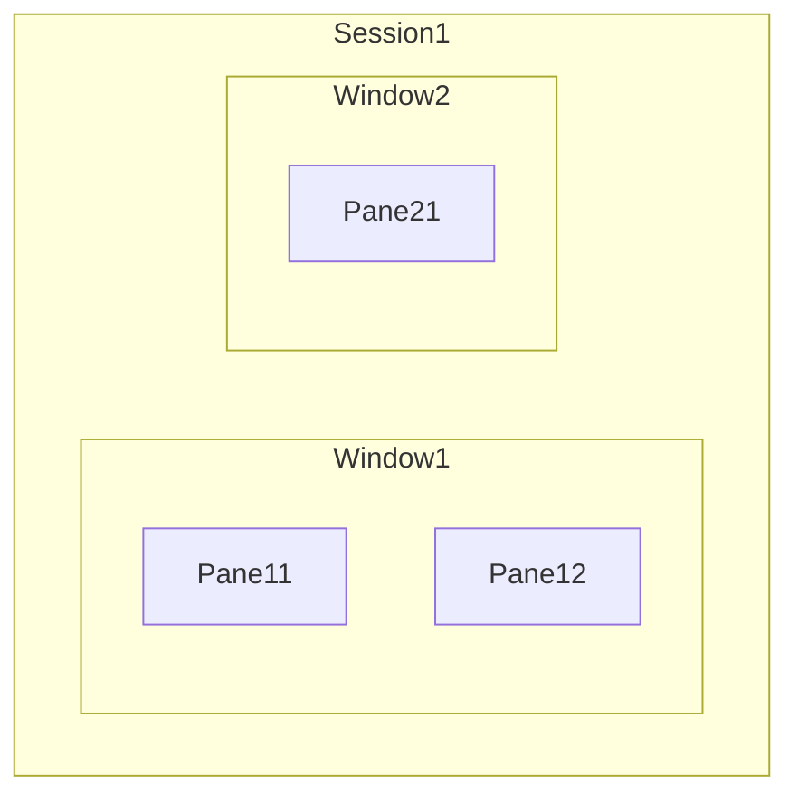

# tmux Terminal Multiplexer

tmux is [awesome and is highly
recommended](https://www.howtogeek.com/671422/how-to-use-tmux-on-linux-and-why-its-better-than-screen/).
Here is a [man page](https://man7.org/linux/man-pages/man1/tmux.1.html).

Why Use Tmux?

* Persistence: If your SSH connection drops, your programs keep running.
* Workflow Efficiency: Split screens for viewing logs, editing code, and running tests simultaneously.
* Customization: Use a .tmux.conf file to change keybindings, add plugins (like tpm), and customize the status bar.
* Copy/Paste: Use Prefix + [ to enter copy mode, allowing you to scroll and copy text with vi-like motions.

## Architecture

Session > Window > Pane:

* Session - for an overall theme, such as work, or experimentation, or
sysadmin, may have more than one window;
* Window - for projects within that theme, may have more than one pane;
* Pane - for view within your current project.

See:

* [primer](primer.html)
* [cheat-sheet](cheat-sheet.html)
