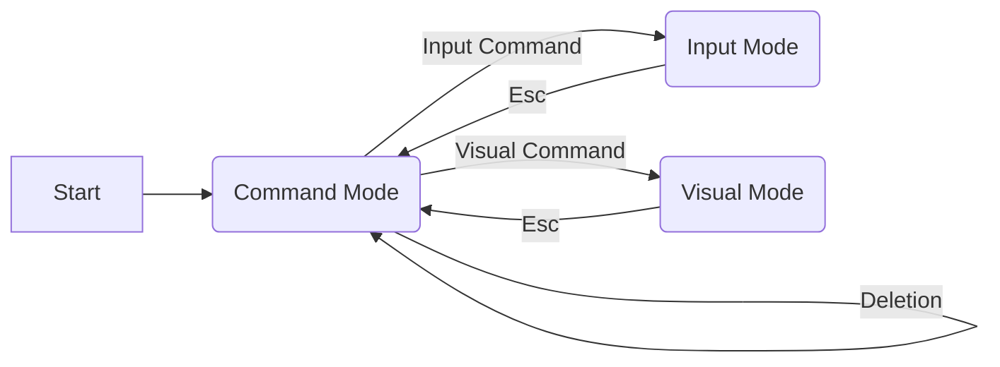

# vi(m) Cheat Sheet

[wiki on vi](https://en.wikipedia.org/wiki/Vi),
the [original article](https://docs.freebsd.org/44doc/usd/12.vi/paper.html).

* [vim cheat sheet](https://vim.rtorr.com/)
* [use vi editor](https://vermaden.wordpress.com/2024/09/23/ghost-in-the-shell-part-8-use-vi-editor/)

## Command Line

Command|Action
-------|------
`vi` _file_|edit _file_
`view` _file_|view _file_
`vi` -r _file_|view _file_
`vi` -R _file_|view _file_
`vi` + _file_|edit _file_, cursor at last line
`vi` +_n_ _file_|edit _file_, cursor at line _n_

## Modes: Command & Input

vi starts in _command mode_. Navigation commands operate in _command mode_.
To switch to _input mode_ enter one of the input commands.
Once in _input mode_, any character you type is added to the file.
To exit the _input mode_, press the Esc key.

see also
[vim transition diagram](https://gist.githubusercontent.com/darcyparker/1886716/raw/c1ee7657010278a787c6502b796a6766a40d56aa/vimModeStateDiagram.svg).

## File Open

Key|Action
---|------
:e _file_|Open _file_ for editing
:e! _file_|Discard changes, open _file_ for editing

## Save, Exit

While in command mode...

Key|Action
---|------
:x|Save and exit
:q|Quit
:q!|Discard changes, quit
:e!|Discard changes since last save
:w|Save
:w!|Save, overwrite protection
:w _file_|Save as _file_
:wq|Save the file, exit vi

## Navigation

While in Command Mode...

### Character/Line Navigation

Key|Action
---|------
h|Back a character
j|Down a line
k|Up a line
l|Forward a character

### IntraLine navigation

Key|Action
---|------
0|Start of the line
^|First non-blank character of the line
$|Last column, End of line

### Word Navigation

Key|Action
---|------
w|One word forward
W|Next word (words can contain punctuation)
e|End of the word
E|End of the word (words can contain punctuation)
b|One word back
B|Previous word (words can contain punctuation)

### Paragraph Navigation

Key|Action
---|------
}|Next paragraph, or function/block
{|Previous paragraph, or function/block

### Goto

Key|Action
---|------
gj|Cursor down (multi-line text)
gk|Cursor up (multi-line text)
ge|Backwards to the end of a word
gE|Backwards to the end of a word (words can contain punctuation)
g_|the last non-blank character of the line
gg|go to the first line
G|go to the last line
1 G|go to the first line
_n_ gg|go to line _n_
_n_ G|go to line _n_
: _n_|go to line _n_
Ctrl+G|display line
gd|move to local declaration
gD|move to global declaration

### Braces Navigation

Key|Action
---|------
`%`|move cursor to the matching character.  Use `:h matchpairs` for more info

### Screen Navigation

Key|Action
---|------
H|Upper left corner (home)
M|Middle line
L|Lower left corner

### Viewport Navigation

Key|Action
---|------
z [Enter]|Cursor at top
z.|Cursor in the middle
z-|Cursor at bottom
zz|Center cursor on screen
zt|Position cursor on top of the screen
zb|Position cursor on bottom of the screen

## Character Search

Key|Action
---|------
f _c_|jump to the next occurrence of character _c_
F _c_|jump to the previous occurrence of character _c_
t _c_|jump to before the next occurrence of character _c_
T _c_|jump to after the previous occurrence of character _c_
;|repeat the previous f, t, F or T movement
,|repeat the previous f, t, F or T movement, backwards

## Search & Replace

Searches are case sensitive by default.

Search case sensitivity|Command
-----------------------|--------
Ignore case|:set ic
Respect case|:set noic

Special characters in search pattern:

Character|Matching
---------|--------
^|Beginning of line
$|End of line
\\<|Beginning of word
\\>|End of word
.|Wildcard characters

Key|Action
---|------
/ _pattern_ |Forward
/ |Repeat forward
? _pattern_|Reverse
? |Repeat reverse
n|Next occurrence in the direction of search
N|Prev occurrence in the direction of search
:g/_from_/s//_to_/g|Global replace
:g/_from_/s//_to_/g|Global replace, consult

## Deletion Commands

While in command mode...

Key|Action
---|------
dd|Delete a line
_n_ dd|Delete n lines
d)|Delete to end of sentence
db|Delete the previous word
D|Delete to the end of line
x|Delete a character

## Undo commands

Key|Action
---|------
u|Undo last change
U|Undo all changes on line

## Input Commands

These force transition to input mode. To get back into command mode, press `Esc`.

Key|Action
---|------
i|Insert before the cursor
a|Insert after the cursor
I|Insert at the beginning of line
A|Insert at the end of line
o|Open line below
O|Open line above
:r _file_|Import a file
:12r _file_|Import a file at line 12

While in the insert mode:

Key|Action
---|------
Ctrl + h|Delete the character before the cursor
Ctrl + w|Delete word before the cursor
Ctrl + j|Add a line break at the cursor position
Ctrl + t|Indent (move right) line one shiftwidth
Ctrl + d|De-indent (move left) line one shiftwidth
Ctrl + n|Insert (auto-complete) next match before the cursor
Ctrl + p|Insert (auto-complete) previous match before the cursor
Ctrl + rx|Insert the contents of register x
Ctrl + ox|Temporarily enter normal mode to issue one normal-mode command x.
Ctrl + c|Exit insert mode
Esc|Exit insert mode

## Visual Commands

Key|Action
---|------
v|begins regular visual mode, and works similar to selecting text with a mouse. Use `h` and `l` to expand the selection left and right to include more words, and use `j` and `k` to expand the selection to the lines below and above.
V|begins linewise visual mode. This selects entire lines of text at a time. Use `j` and `k` to expand the selection up and down.
Ctrl+v|enters block visual mode. This selects text in a block format, allowing to select parts of multiple lines without including the entire line. Use `h`, `j`, `k`, `l` as usual.

Once the selection is done, use:

Key|Action
---|------
Esc|exit visual mode
d|delete the text
y|yank (copy) the text
p|paste your clipboard onto the text, replacing it
c|change the text, which deletes it and sets your cursor for typing
r|replace the text with the next character you type
`y`,`q`, `/`, `p`|search for the text elsewhere in your document
`>`|indent the text, removes selection
`<`|unindent the selection, removes selection
