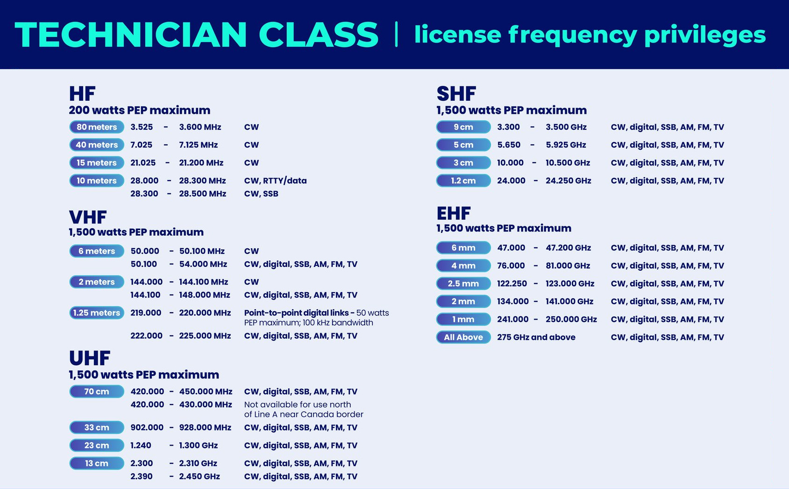
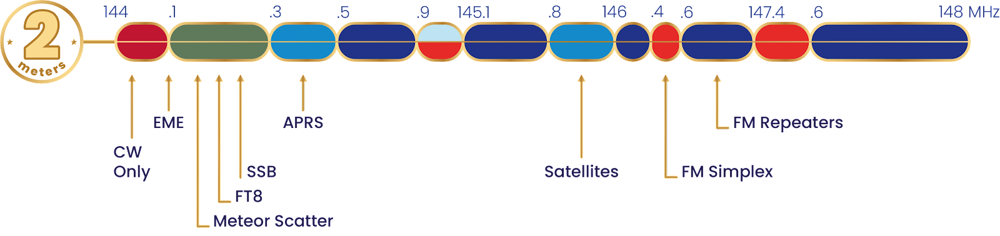

# HAM (and Others) Bands

* HF is the range from 3 to 30 MHz
* VHF is between 30 and 300 MHz
* UHF is between 300 and 3000 MHz.

[Ham Radio Frequencies](https://www.dxzone.com/ham-radio-frequencies/)

[band-plans](https://hamradioprep.com/band-plans/#elementor-toc__heading-anchor-0),
[band-plan](https://www.arrl.org/band-plan)

## 80m HF band (3.500-4.000 MHz)

ITU Region|Band
----------|----
1|3.5 – 3.8 MHz
2|3.5 – 4.0 MHz
3|3.5 – 3.9 MHz

Upper part of the 80m Band in ITU Region 2 countries, is commonly named as 75m band.

The [80-meter band](https://en.wikipedia.org/wiki/80-meter_band) is considered the most reliable all-season long-distance (DX) band. It is popular for DX contacts at night and reliable for medium-distance contacts during the day. In the US and Canada, a portion of this band allows for single-sideband voice and AM voice transmissions.

This band is good for local communications during the day, and hardly ever good for communications over intercontinental distances during daylight hours. During late afternoon and night , when noise decreases, it can be effective even for worldwide communications.

Bands below 10 MHz use lower sideband (LSB).

## 40m HF band (7.000-7.300 MHz)

ITU Region|Band
----------|----
1|7.0 – 7.2 MHz
2|7.0 – 7.3 MHz
3|7.0 – 7.2 MHz

The [40-meter band](https://en.wikipedia.org/wiki/40-meter_band) is considered the most reliable all-season long-distance (DX) band. It is popular for DX contacts at night and reliable for medium-distance contacts during the day. This band is now free of other users due to the shutdown of many shortwave broadcasting services.

Bands below 10 MHz use lower sideband (LSB).

## 20m HF band (14.000-14.350 MHz)

The [20-meter band](https://en.wikipedia.org/wiki/20-meter_band) is considered the most popular DX band and is usually most active during the daytime. It is commonly used for DX operations in all modes. This band permits long distance contacts, even when other bands are closed, and this is the reason why it is particularly crowded during contests.

Bands 10 MHz and above, use upper sideband (USB).

## 10m HF band (28.000-29.700 MHz)

The [10m band](https://en.wikipedia.org/wiki/10-meter_band) is a portion of the shortwave radio spectrum internationally allocated to amateur radio and amateur satellite use on a primary basis.

The best time for long-distance 10m band propagation via the F layer - from dawn to shortly after sunset during periods of high sunspot activity.

## 6m VHF band (50.000-54.000 MHz)

The [6-meter band](https://en.wikipedia.org/wiki/6-meter_band) is best suited for communicating via meteor scatter.

## 2m VHF band (144-148 MHz)

 is one of the most popular non-HF ham bands.

ITU Region|Band
----------|----
1|144 – 146 MHz
2|144 – 148 MHz
3|144 – 148 MHz

Common repeater frequency offset: ±600kHz

## Weather Band (161-164 MHz)

[Weather Radio](https://en.wikipedia.org/wiki/Weather_radio)

## 1.25m VHF band (219-220 MHz, 222-225 MHz)

The [1.25m band](https://en.wikipedia.org/wiki/1.25-meter_band) is primarily used for local communications.

ITU Region|Band
----------|----
1|NA
2|222 – 225 MHz
3|NA

## 70cm UHF band (430-440 MHz)

The [70cm band](https://en.wikipedia.org/wiki/70-centimeter_band) is a popular ham band due to the ready availability of equipment in both new and used markets. Amateurs usually use the band for FM or digital voice communications through repeaters, as well narrow band modes (analog and digital) for long-distance communications (called "DX", including Moon bounce). The band is also popular for Amateur Satellite Service.

Common repeater frequency offset: ±5MHz

## GMRS Band (462-467 MHz)

[GMRS band](https://en.wikipedia.org/wiki/General_Mobile_Radio_Service#Frequency_assignments) is shared with [Family Radio Service](https://en.wikipedia.org/wiki/Family_Radio_Service) (FRS).

Channels:

Ch|MHz Tx/Rx
--|--
1|462.5625
2|462.5875
3|462.6125
4|462.6375
5|462.6625
6|462.6875
7|462.7125
8|467.5625
9|467.5875
10|467.6125
11|467.6375
12|467.6625
13|467.6875
14|467.7125
15|462.5500
16|462.5750
17|462.6000
18|462.6250
19|462.6500
20|462.6750
21|462.7000
22|462.7250
23|467.5500/462.5500
24|467.5750/462.5750
25|467.6000/462.6000
26|467.6250/462.6250
27|467.6500/462.6500
28|467.6750/462.6750
29|467.7000/462.7000
30|467.7250/462.7250

## 33cm UHF band (902-928 MHz)

The [33cm band](https://en.wikipedia.org/wiki/33-centimeter_band) is primarily used for very local communications.

## 23cm UHF band (1240-1300 MHz)

The [23cm band](https://en.wikipedia.org/wiki/23-centimeter_band).

## 13cm UHF band (2.3-2.450 GHz)

The [13cm band](https://en.wikipedia.org/wiki/13-centimeter_band).
