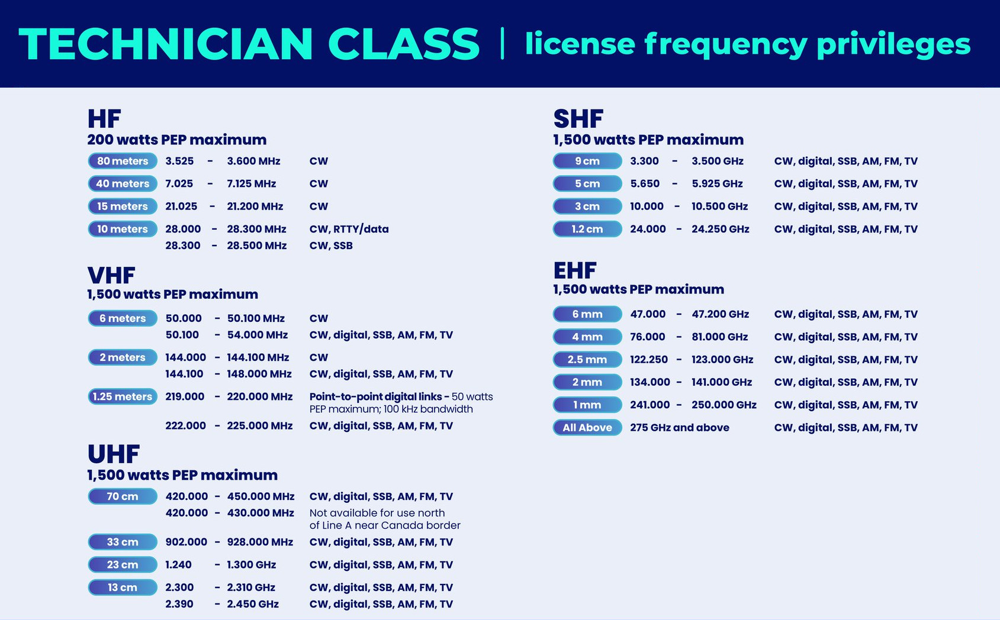
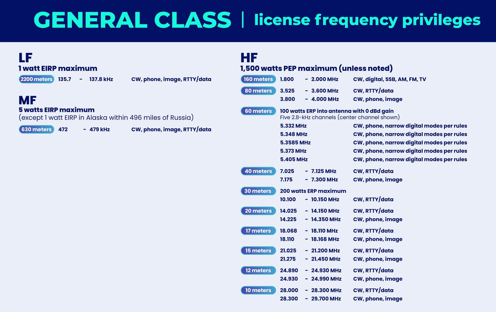
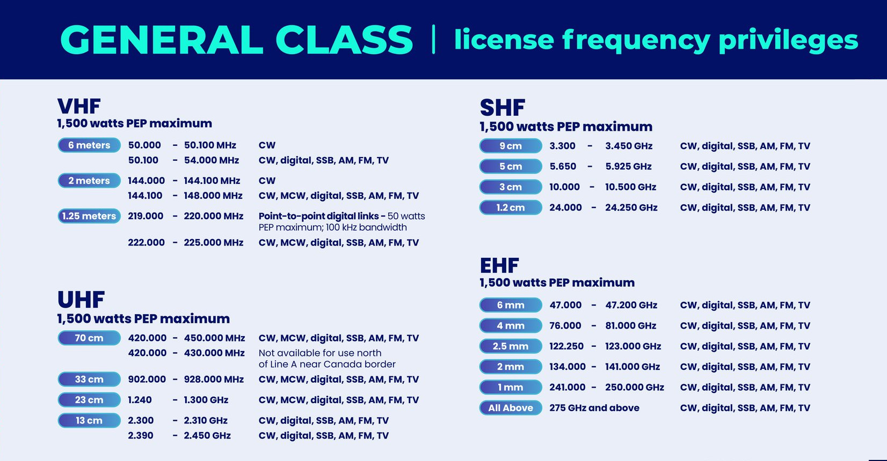

# HAM (and Others) Bands

* HF is the range from 3 to 30 MHz
* VHF is between 30 and 300 MHz
* UHF is between 300 and 3000 MHz.

[Ham Radio Frequencies](https://www.dxzone.com/ham-radio-frequencies/)

## Band Plans

[band-plans](https://hamradioprep.com/band-plans/#elementor-toc__heading-anchor-0),
[band-plan](https://www.arrl.org/band-plan)

### Technician License Privileges

### General License Privileges

## 160m HF band (1.8-2.0 MHz)

Freq|Use
----|---
1.800 - 2.000|CW
1.800 - 1.810|Digital Modes
1.810|CW QRP
1.843-2.000|SSB, SSTV and other wideband modes
1.910|SSB QRP
1.995 - 2.000|Experimental
1.999 - 2.000|Beacons

## 80m HF band (3.500-4.000 MHz)

ITU Region|Band
----------|----
1|3.5 – 3.8 MHz
2|3.5 – 4.0 MHz
3|3.5 – 3.9 MHz

Upper part of the 80m Band in ITU Region 2 countries, is commonly named as 75m band.

The [80-meter band](https://en.wikipedia.org/wiki/80-meter_band) is considered the most reliable all-season long-distance (DX) band. It is popular for DX contacts at night and reliable for medium-distance contacts during the day. In the US and Canada, a portion of this band allows for single-sideband voice and AM voice transmissions.

This band is good for local communications during the day, and hardly ever good for communications over intercontinental distances during daylight hours. During late afternoon and night , when noise decreases, it can be effective even for worldwide communications.

Bands below 10 MHz use lower sideband (LSB).

Freq|Use
----|---
3.590|RTTY/Data DX
3.570-3.600|RTTY/Data
3.790-3.800|DX window
3.845|SSTV
3.885|AM calling frequency

## 60m HF band (5 MHz)

* Only one signal at a time is permitted on any channel
* Maximum effective radiated output is 100 W PEP

Freq|Use
----|---
5330.5|USB phone1 and CW/RTTY/data2
5346.5|USB phone1 and CW/RTTY/data2
5357.0|USB phone1 and CW/RTTY/data2
5371.5|USB phone1 and CW/RTTY/data2
5403.5|USB phone1 and CW/RTTY/data2

1. USB is limited to 2.8 kHz
2. CW and digital emissions must be centered 1.5 kHz above the channel frequencies indicated in the above chart

## 40m HF band (7.000-7.300 MHz)

ITU Region|Band
----------|----
1|7.0 – 7.2 MHz
2|7.0 – 7.3 MHz
3|7.0 – 7.2 MHz

The [40-meter band](https://en.wikipedia.org/wiki/40-meter_band) is considered the most reliable all-season long-distance (DX) band. It is popular for DX contacts at night and reliable for medium-distance contacts during the day. This band is now free of other users due to the shutdown of many shortwave broadcasting services.

Bands below 10 MHz use lower sideband (LSB).

Freq|Use
----|---
7.040|RTTY/Data DX
7.080-7.125|RTTY/Data
7.171|SSTV
7.290|AM calling frequency

## 30m HF band (10.1-10.15 MHz)

Freq|Use
----|---
10.130-10.140|RTTY
10.140-10.150|Packet

## 20m HF band (14.000-14.350 MHz)

The [20-meter band](https://en.wikipedia.org/wiki/20-meter_band) is considered the most popular DX band and is usually most active during the daytime. It is commonly used for DX operations in all modes. This band permits long distance contacts, even when other bands are closed, and this is the reason why it is particularly crowded during contests.

Bands 10 MHz and above, use upper sideband (USB).

Freq|Use
----|---
14.070-14.095|RTTY
14.095-14.0995|Packet
14.100|NCDXF Beacons
14.1005-14.112|Packet
14.230|SSTV
14.286|AM calling frequency

## 17m band (18.068-18.168 MHz)

Freq|Use
----|---
18.100-18.105|RTTY
18.105-18.110|Packet

## 15m band (21.0-21.45 MHz)

Freq|Use
----|---
21.070-21.110|RTTY/Data
21.340|SSTV

## 12m band (24.89-24.99 MHz)

Freq|Use
----|---
24.920-24.925|RTTY
24.925-24.930|Packet

## CB band

27.065	Channel 9 on CB Radios, commonly considered the emergency frequency for CB and is still monitored by teams and law enforcement
27.185	Channel 19 on CB Radios, the most used CB channel, especially active around highways

## 10m HF band (28.000-29.700 MHz)

The [10m band](https://en.wikipedia.org/wiki/10-meter_band) is a portion of the shortwave radio spectrum internationally allocated to amateur radio and amateur satellite use on a primary basis.

The best time for long-distance 10m band propagation via the F layer - from dawn to shortly after sunset during periods of high sunspot activity.

Freq|Use
----|---
28.000-28.070|CW
28.070-28.150|RTTY
28.150-28.190|CW
28.200-28.300|Beacons
28.300-29.300|Phone
28.680|SSTV
29.000-29.200|AM
29.300-29.510|Satellite Uplinks or Downlinks
29.520-29.590|Repeater Inputs
29.600|FM Simplex
29.610-29.700|Repeater Outputs

## 6m VHF band (50.000-54.000 MHz)

The [6-meter band](https://en.wikipedia.org/wiki/6-meter_band) is best suited for communicating via meteor scatter.

Freq|Use
----|---
50.0-50.1|CW, beacons
50.060-50.080|beacon subband
50.1-50.3|SSB, CW
50.10-50.125|DX window
50.125|SSB calling
50.3-50.6|All modes
50.6-50.8|Nonvoice communications
50.62|Digital (packet) calling
50.8-51.0|Radio remote control (20-kHz channels)
51.0-51.1|Pacific DX window
51.12-51.48|Repeater inputs (19 channels)
51.12-51.18|Digital repeater inputs
51.5-51.6|Simplex (six channels)
51.62-51.98|Repeater outputs (19 channels)
51.62-51.68|Digital repeater outputs
52.0-52.48|Repeater inputs (except as noted; 23 channels)
52.02, 52.04|FM simplex
52.2|TEST PAIR (input)
52.5-52.98|Repeater output (except as noted; 23 channels)
52.525|Primary FM simplex
52.54|Secondary FM simplex
52.7|TEST PAIR (output)
53.0-53.48|Repeater inputs (except as noted; 19 channels)
53.0|Remote base FM simplex
53.02|Simplex
53.1, 53.2, 53.3, 53.4|Radio remote control
53.5-53.98|Repeater outputs (except as noted; 19 channels)
53.5, 53.6, 53.7, 53.8|Radio remote control
53.52, 53.9|Simplex

## Aviation Band

121.500	Aviation Emergency & Distress
121.500	Air Search and Rescue
123.100	Aviation Search and Rescue

## 2m VHF band (144-148 MHz)

 is one of the most popular non-HF ham bands.

ITU Region|Band
----------|----
1|144 – 146 MHz
2|144 – 148 MHz
3|144 – 148 MHz

Common repeater frequency offset: ±600kHz

146.520	2-meter band National Simplex Channel

Freq|Use
----|---
144.00-144.05|EME (CW)
144.05-144.10|General CW and weak signals
144.10-144.20|EME and weak-signal SSB
144.200|National calling frequency
144.200-144.275|General SSB operation
144.275-144.300|Propagation beacons
144.30-144.50|New OSCAR subband
144.50-144.60|Linear translator inputs
144.60-144.90|FM repeater inputs
144.90-145.10|Weak signal and FM simplex (145.01,03,05,07,09 are widely used for packet)
145.10-145.20|Linear translator outputs
145.20-145.50|FM repeater outputs
145.50-145.80|Miscellaneous and experimental modes
145.80-146.00|OSCAR subband
146.01-146.37|Repeater inputs
146.40-146.58|Simplex
146.52|National Simplex Calling Frequency
146.61-146.97|Repeater outputs
147.00-147.39|Repeater outputs
147.42-147.57|Simplex
147.60-147.99|Repeater inputs

Notes: The frequency 146.40 MHz is used in some areas as a repeater input. This band plan has been proposed by the ARRL VHF-UHF Advisory Committee.

## MURS Band (151 MHz)

151.820	Multi Use Radio Service (MURS)
151.880	Multi Use Radio Service (MURS)

## 155 MHz

155.160	Land Search and Rescue

## Marine Radio Band (156 MHz)

156.800	Marine Distress Safety and Calling (Marine Radio Channel 16)
157.100	U.S. Coast Guard Liaison (Marine Radio Channel 22)
156.300	Marine Intership Safety (Marine Radio Channel 6)

## 161 MHz

161.205	Railroad Police Mutual Aid

## Weather Band (161-164 MHz)

[Weather Radio](https://en.wikipedia.org/wiki/Weather_radio)

162.400	NOAA / National Weather Service broadcast frequency
162.425	NOAA / National Weather Service broadcast frequency
162.450	NOAA / National Weather Service broadcast frequency
162.475	NOAA / National Weather Service broadcast frequency
162.500	NOAA / National Weather Service broadcast frequency
162.525	NOAA / National Weather Service broadcast frequency
162.550	NOAA / National Weather Service broadcast frequency

## 1.25m VHF band (219-220 MHz, 222-225 MHz)

The [1.25m band](https://en.wikipedia.org/wiki/1.25-meter_band) is primarily used for local communications.

ITU Region|Band
----------|----
1|NA
2|222 – 225 MHz
3|NA

223.500	1.25-meter band National Simplex Channel

222.0-222.150 	Weak-signal modes
222.0-222.025 	EME
222.05-222.06 	Propagation beacons
222.1 	SSB & CW calling frequency
222.10-222.15 	Weak-signal CW & SSB
222.15-222.25 	Local coordinator's option; weak signal, ACSB, repeater inputs, control
222.25-223.38 	FM repeater inputs only
223.40-223.52 	FM simplex
223.52-223.64 	Digital, packet
223.64-223.70 	Links, control
223.71-223.85 	Local coordinator's option; FM simplex, packet, repeater outputs
223.85-224.98 	Repeater outputs only

Note: The 222 MHz band plan was adopted by the ARRL Board of Directors in July 1991.

## 70cm UHF band (430-440 MHz)

The [70cm band](https://en.wikipedia.org/wiki/70-centimeter_band) is a popular ham band due to the ready availability of equipment in both new and used markets. Amateurs usually use the band for FM or digital voice communications through repeaters, as well narrow band modes (analog and digital) for long-distance communications (called "DX", including Moon bounce). The band is also popular for Amateur Satellite Service.

Common repeater frequency offset: ±5MHz

446.000	70 cm band National Simplex Channel

## GMRS Band (462-467 MHz)

[GMRS band](https://en.wikipedia.org/wiki/General_Mobile_Radio_Service#Frequency_assignments) is shared with [Family Radio Service](https://en.wikipedia.org/wiki/Family_Radio_Service) (FRS).

Channels:

Ch|MHz Tx/Rx
--|--
1|462.5625
2|462.5875
3|462.6125
4|462.6375
5|462.6625
6|462.6875
7|462.7125
8|467.5625
9|467.5875
10|467.6125
11|467.6375
12|467.6625
13|467.6875
14|467.7125
15|462.5500
16|462.5750
17|462.6000
18|462.6250
19|462.6500
20|462.6750
21|462.7000
22|462.7250
23|467.5500/462.5500
24|467.5750/462.5750
25|467.6000/462.6000
26|467.6250/462.6250
27|467.6500/462.6500
28|467.6750/462.6750
29|467.7000/462.7000
30|467.7250/462.7250

462.675	GMRS emergency frequency (Channel 20)

## 33cm UHF band (902-928 MHz)

The [33cm band](https://en.wikipedia.org/wiki/33-centimeter_band) is primarily used for very local communications.

906.500	33 cm band National Simplex Channel

## 23cm UHF band (1240-1300 MHz)

The [23cm band](https://en.wikipedia.org/wiki/23-centimeter_band).

1294.500	23 cm band National Simplex Channel

## 13cm UHF band (2.3-2.450 GHz)

The [13cm band](https://en.wikipedia.org/wiki/13-centimeter_band).
