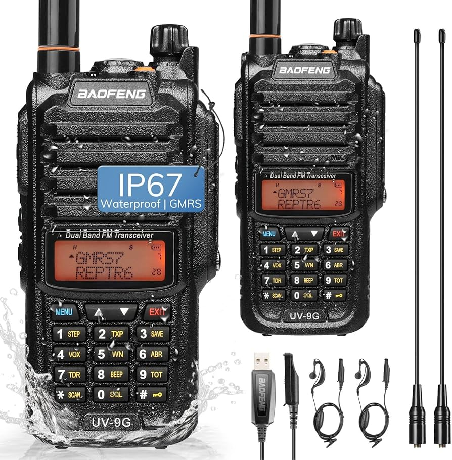

# GMRS Radio

[General Mobile Radio Service](https://en.wikipedia.org/wiki/General_Mobile_Radio_Service) (GMRS) is a land-mobile FM UHF radio service designed for short-range two-way voice communication and authorized under part 95 of the US FCC code.

The US GMRS license is issued for a period of 10 years. The United States permits use by adult individuals who possess a valid GMRS license, as well as their immediate family members. Immediate relatives of the GMRS system licensee are entitled to communicate among themselves for personal or business purposes.

WSGN834

## Hardware

[how to use a gmrs radio](https://www.baofengradio.com/blogs/news/how-easy-to-use-a-gmrs-radio)

## Baofeng UV-5G Plus

[Manual](https://radioddity.s3.amazonaws.com/Baofeng%20UV-5X%20%20User%20Manual_20210220.pdf)

## Baofeng UV-9G

{:target="_blank"}

[Manual](https://baofeng.s3.amazonaws.com/BAOFENG_UV-9G_GMRS_User_Manual_20210806.pdf)
