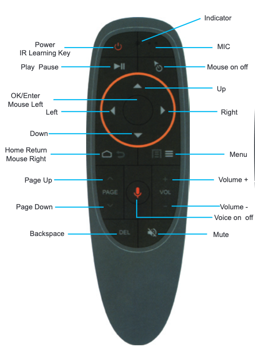

# G10 Air Mouse Remote

This is about $10 remote readily
[available](https://www.amazon.com/gp/product/B08DFDNZCV/) on Amazon.
[Manual](https://fccid.io/2A6FK-G10/User-Manual/User-manual-5829169.pdf).

## IR Learning of the Power

* press and hold Power until LED flashes slowly
* press Power button.  LED flashes if learned.
* LED flashes slowly when learning completed

Press OK and DEL to clean the learned codes.

## Receiver/Remote Pairing

Press and hold OK + Home.

## Adjust mouse speed - 3 levels

Press OK + Volume+ / Volume-.

## Low Battery Indicator

Red LED flashes slowly.

## Troubleshooting

https://forums.linuxmint.com/viewtopic.php?t=309385

## Summary

### Pros

* Decent fit and finish

### Cons

* Volume function can not be learned
* No backlight
