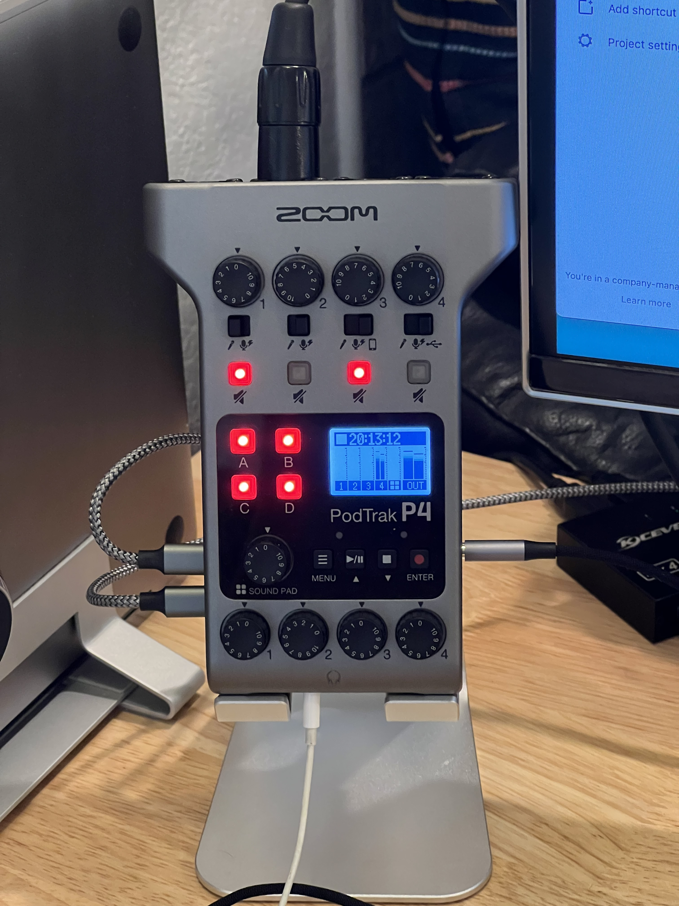

# Business Audio Setup

I use [Zoom PodTrack P4](https://www.amazon.com/dp/B08F8HL7T7) as a hub for my
work-from-home setup, which allows me to:

* use
[Rode NTG-1](https://www.amazon.com/Rode-NTG1-Lightweight-Supercardioid-Microphone/dp/B00093J07C/)
mic for both computer and regular telephone communication
* record phone calls made/taken on my iPhone
* record calls made on my laptop
* conference phone calls and laptop calls.

PodTrack P4 setup details:

- input 1: not used, muted
- input 2: Rode NTG1 via XLR cable, phantom power on, level at 5
- input 3: switch to phone, level at 7 - iPhone connected via
[lightning to headphone jack adapter](https://www.amazon.com/dp/B01LXJFMGF)
and a
[TRRS male to male](https://www.amazon.com/dp/B08RB17ZY1) cable
- input 3: switch to USB, level at 5
- output 2: wired earphones, can use be plugged into any output really
- [2xUSB cables](https://www.amazon.com/dp/B089DM4KDW) - one to the laptop,
another to the power supply.
- laptop sound output and input are set to "Zoom P4 Audio"

Amazingly this is all plug and play!  Minor CONS:

- a fixed sampling rate of 44kHz can not be justified
- filters are limited to Low Cut and Limiter.  The latter is nice and I use it.
Compressor is missing and is badly missed.
- no 1/4-20 mounting, seriously?  As a workaround I use
[Omoton Adjustable Tablet Stand](https://www.amazon.com/Adjustable-Upgraded-Greater-Stability-OMOTON/dp/B08LYSTZV9/)
- why two USB cables?  Surely P4 can be powered from a laptop!
- sound pad and mute LEDs are too bright and are distracting, would be nice to
control/disable brightness.
- NO indication of input overload!
- LCD display is from the 20th century, as a workaround I used OBS to set the
levels
- earphone amps are REALLY noisy
