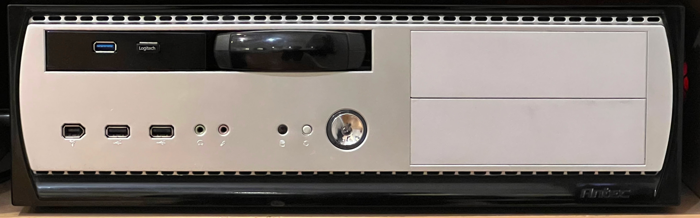
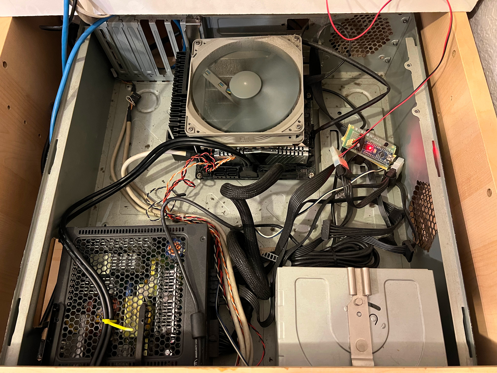

# duo

Virtualization server with GPU and SATA HDs passed through.
Runs an HTPC VM with GPU passed through.  Retired.  Parts reused in
[exi](../exi/).

## Hardware

Item|Description
----|----------
CPU|Intel i5-9400 6C/6T 2.90 GHz up to 4.10 GHz Turbo LGA1151 65W BX80684I59400
CPU Fan|Noctua NF-P14s redux-1200 PWM, Quiet Fan, 4-Pin, 1200rpm
CPU Cooler|Cooler Master GeminII S524 Version 2 with 5 Direct Contact Heat Pipes (RR-G5V2-20PK-R1)
Motherboard|ASRock Z370M-ITX/ac LGA 1151 (300 Series) Intel Z370 HDMI SATA 6Gb/s USB 3.1 Mini ITX
RAM|ADATA XPG Z1 DDR4 PC4 25600 3200MHz 2x8GB AX4U320038G16A-DSZ1
Ethernet|I219-V, I211
Graphics|Intel UHD Graphics 630
GPU|MSI Graphic Cards GeForce GT 1030  2GB GDDR5 LP OC HDMI 2.0b / DisplayPort V1.4
SSD|500GB WD Blue SN550 NVMe M.2 2280, 3D NAND, Up to 2,400 MB/s - WDS500G2B0C
PSU|SeaSonic SS-400FL2 Active PFC F3 400W 80 PLUS Platinum Fanless ATX12V / EPS12V
Case|Antec
OS|ProxMox, Ubuntu
Monitor|Samsung QN75Q80TAFXZA
Speakers|SAMSUNG HW-Q950T 9.1.4 Soundbar + Sub + Surrounds


<p align="center" width="100%">
    
    
</p>

## PCI Devices

```
root@duo:~# lspci
00:00.0 Host bridge: Intel Corporation 8th Gen Core Processor Host Bridge/DRAM Registers (rev 07)
00:01.0 PCI bridge: Intel Corporation 6th-10th Gen Core Processor PCIe Controller (x16) (rev 07)
00:02.0 VGA compatible controller: Intel Corporation CometLake-S GT2 [UHD Graphics 630]
00:14.0 USB controller: Intel Corporation 200 Series/Z370 Chipset Family USB 3.0 xHCI Controller
00:14.2 Signal processing controller: Intel Corporation 200 Series PCH Thermal Subsystem
00:16.0 Communication controller: Intel Corporation 200 Series PCH CSME HECI #1
00:1c.0 PCI bridge: Intel Corporation 200 Series PCH PCI Express Root Port #1 (rev f0)
00:1c.5 PCI bridge: Intel Corporation 200 Series PCH PCI Express Root Port #6 (rev f0)
00:1d.0 PCI bridge: Intel Corporation 200 Series PCH PCI Express Root Port #9 (rev f0)
00:1f.0 ISA bridge: Intel Corporation Z370 Chipset LPC/eSPI Controller
00:1f.2 Memory controller: Intel Corporation 200 Series/Z370 Chipset Family Power Management Controller
00:1f.3 Audio device: Intel Corporation 200 Series PCH HD Audio
00:1f.4 SMBus: Intel Corporation 200 Series/Z370 Chipset Family SMBus Controller
00:1f.6 Ethernet controller: Intel Corporation Ethernet Connection (2) I219-V
01:00.0 VGA compatible controller: NVIDIA Corporation GP108 [GeForce GT 1030] (rev a1)
01:00.1 Audio device: NVIDIA Corporation GP108 High Definition Audio Controller (rev a1)
03:00.0 Ethernet controller: Intel Corporation I211 Gigabit Network Connection (rev 03)
04:00.0 Non-Volatile memory controller: Sandisk Corp WD Blue SN550 NVMe SSD (rev 01)
```

## USB Devices

```
root@duo:~# lsusb
Bus 002 Device 001: ID 1d6b:0003 Linux Foundation 3.0 root hub
Bus 001 Device 003: ID 046d:c52b Logitech, Inc. Unifying Receiver
Bus 001 Device 002: ID 0471:0815 Philips (or NXP) eHome Infrared Receiver
Bus 001 Device 004: ID 1bcf:28c4 Sunplus Innovation Technology Inc. FHD Camera Microphone
Bus 001 Device 001: ID 1d6b:0002 Linux Foundation 2.0 root hub
```

## Networking

```
root@duo:~# lspci|grep -i eth
00:1f.6 Ethernet controller: Intel Corporation Ethernet Connection (2) I219-V
03:00.0 Ethernet controller: Intel Corporation I211 Gigabit Network Connection (rev 03)
```
Hence:
* [I219-V](https://ark.intel.com/content/www/us/en/ark/products/82186/intel-ethernet-connection-i219v.html)
is just a [PHY](https://en.wikipedia.org/wiki/Physical_layer) with TDP of just
0.5W, [datasheet](https://cdrdv2.intel.com/v1/dl/getcontent/612523)
* [I211](https://www.intel.com/content/www/us/en/products/sku/64404/intel-ethernet-controller-i211at/specifications.html),
[datasheet](https://cdrdv2.intel.com/v1/dl/getcontent/333017) is a PCIe NIC.


```
root@duo:~# ip link
1: lo: <LOOPBACK,UP,LOWER_UP> mtu 65536 qdisc noqueue state UNKNOWN mode DEFAULT group default qlen 1000
    link/loopback 00:00:00:00:00:00 brd 00:00:00:00:00:00
2: enp3s0: <BROADCAST,MULTICAST,UP,LOWER_UP> mtu 1500 qdisc mq master vmbr1 state UP mode DEFAULT group default qlen 1000
    link/ether 70:85:c2:66:f8:7b brd ff:ff:ff:ff:ff:ff
3: eno1: <BROADCAST,MULTICAST,UP,LOWER_UP> mtu 1500 qdisc pfifo_fast master vmbr0 state UP mode DEFAULT group default qlen 1000
    link/ether 70:85:c2:66:f8:7d brd ff:ff:ff:ff:ff:ff
    altname enp0s31f6
```

From the above you can see that:

* `eno1`, a.k.a `enp0s31f6`, is an `I219-V` NIC
* `enp3s0` is an `I211` NIC

Ethernet drivers used:

```
root@duo:~# ethtool -i enp0s31f6
driver: e1000e
version: 5.15.85-1-pve
firmware-version: 0.2-4
expansion-rom-version:
bus-info: 0000:00:1f.6
supports-statistics: yes
supports-test: yes
supports-eeprom-access: yes
supports-register-dump: yes
supports-priv-flags: yes

root@duo:~# ethtool -i enp3s0
driver: igb
version: 5.15.85-1-pve
firmware-version:  0. 4-1
expansion-rom-version:
bus-info: 0000:03:00.0
supports-statistics: yes
supports-test: yes
supports-eeprom-access: yes
supports-register-dump: yes
supports-priv-flags: yes
```

Blacklist `igb` driver.

```
root@duo:~# cat /etc/modprobe.d/pve-blacklist.conf
# This file contains a list of modules which are not supported by Proxmox VE

# nidiafb see bugreport https://bugzilla.proxmox.com/show_bug.cgi?id=701
blacklist nvidiafb
root@duo:~# echo "blacklist igb" >> /etc/modprobe.d/blacklist.conf
```

After reboot `igb` is still being used!

Yet I successfully passed the PCI device `enp3s0` (all functions, PCIx -
not sure this is needed) and it works.


## DMI Info

```
root@duo:~# sudo dmidecode
# dmidecode 3.3
Getting SMBIOS data from sysfs.
SMBIOS 3.1.1 present.
Table at 0x6EDC1000.

Handle 0x0000, DMI type 0, 26 bytes
BIOS Information
	Vendor: American Megatrends Inc.
	Version: P4.20
	Release Date: 10/31/2019
	Address: 0xF0000
	Runtime Size: 64 kB
	ROM Size: 16 MB
	Characteristics:
		PCI is supported
		BIOS is upgradeable
		BIOS shadowing is allowed
		Boot from CD is supported
		Selectable boot is supported
		BIOS ROM is socketed
		EDD is supported
		5.25"/1.2 MB floppy services are supported (int 13h)
		3.5"/720 kB floppy services are supported (int 13h)
		3.5"/2.88 MB floppy services are supported (int 13h)
		Print screen service is supported (int 5h)
		8042 keyboard services are supported (int 9h)
		Serial services are supported (int 14h)
		Printer services are supported (int 17h)
		ACPI is supported
		USB legacy is supported
		BIOS boot specification is supported
		Targeted content distribution is supported
		UEFI is supported
	BIOS Revision: 5.12

....

Handle 0x0002, DMI type 2, 15 bytes
Base Board Information
	Manufacturer: ASRock
	Product Name: Z370M-ITX/ac
	Version:
	Serial Number: M80-AB007100110
	Asset Tag:
	Features:
		Board is a hosting board
		Board is replaceable
	Location In Chassis:
	Chassis Handle: 0x0003
	Type: Motherboard
	Contained Object Handles: 0

...

Handle 0x000A, DMI type 16, 23 bytes
Physical Memory Array
	Location: System Board Or Motherboard
	Use: System Memory
	Error Correction Type: None
	Maximum Capacity: 32 GB
	Error Information Handle: Not Provided
	Number Of Devices: 2

Handle 0x000B, DMI type 17, 40 bytes
Memory Device
	Array Handle: 0x000A
	Error Information Handle: Not Provided
	Total Width: 64 bits
	Data Width: 64 bits
	Size: 8 GB
	Form Factor: DIMM
	Set: None
	Locator: ChannelA-DIMM0
	Bank Locator: BANK 0
	Type: DDR4
	Type Detail: Synchronous Unbuffered (Unregistered)
	Speed: 2667 MT/s
	Manufacturer: 04CB
	Serial Number: 73810000
	Asset Tag: 9876543210
	Part Number: DDR4 3200
	Rank: 1
	Configured Memory Speed: 2667 MT/s
	Minimum Voltage: 1.2 V
	Maximum Voltage: 1.2 V
	Configured Voltage: 1.2 V

Handle 0x000C, DMI type 17, 40 bytes
Memory Device
	Array Handle: 0x000A
	Error Information Handle: Not Provided
	Total Width: 64 bits
	Data Width: 64 bits
	Size: 8 GB
	Form Factor: DIMM
	Set: None
	Locator: ChannelB-DIMM0
	Bank Locator: BANK 2
	Type: DDR4
	Type Detail: Synchronous Unbuffered (Unregistered)
	Speed: 2667 MT/s
	Manufacturer: 04CB
	Serial Number: 4C8B0000
	Asset Tag: 9876543210
	Part Number: DDR4 3200
	Rank: 1
	Configured Memory Speed: 2667 MT/s
	Minimum Voltage: 1.2 V
	Maximum Voltage: 1.2 V
	Configured Voltage: 1.2 V

Handle 0x000D, DMI type 19, 31 bytes
Memory Array Mapped Address
	Starting Address: 0x00000000000
	Ending Address: 0x003FFFFFFFF
	Range Size: 16 GB
	Physical Array Handle: 0x000A
	Partition Width: 2

Handle 0x000E, DMI type 7, 27 bytes
Cache Information
	Socket Designation: L1 Cache
	Configuration: Enabled, Not Socketed, Level 1
	Operational Mode: Write Back
	Location: Internal
	Installed Size: 0 kB
	Maximum Size: 0 kB
	Supported SRAM Types:
		Synchronous
	Installed SRAM Type: Synchronous
	Speed: Unknown
	Error Correction Type: Parity
	System Type: Unified
	Associativity: 8-way Set-associative

Handle 0x000F, DMI type 7, 27 bytes
Cache Information
	Socket Designation: L2 Cache
	Configuration: Enabled, Not Socketed, Level 2
	Operational Mode: Write Back
	Location: Internal
	Installed Size: 0 kB
	Maximum Size: 0 kB
	Supported SRAM Types:
		Synchronous
	Installed SRAM Type: Synchronous
	Speed: Unknown
	Error Correction Type: Single-bit ECC
	System Type: Unified
	Associativity: 4-way Set-associative

Handle 0x0010, DMI type 7, 27 bytes
Cache Information
	Socket Designation: L3 Cache
	Configuration: Enabled, Not Socketed, Level 3
	Operational Mode: Write Back
	Location: Internal
	Installed Size: 0 kB
	Maximum Size: 0 kB
	Supported SRAM Types:
		Synchronous
	Installed SRAM Type: Synchronous
	Speed: Unknown
	Error Correction Type: Multi-bit ECC
	System Type: Unified
	Associativity: 12-way Set-associative

Handle 0x0011, DMI type 4, 48 bytes
Processor Information
	Socket Designation: CPUSocket
	Type: Central Processor
	Family: Core i5
	Manufacturer: Intel(R) Corporation
	ID: EA 06 09 00 FF FB EB BF
	Signature: Type 0, Family 6, Model 158, Stepping 10
	Flags:
		FPU (Floating-point unit on-chip)
		VME (Virtual mode extension)
		DE (Debugging extension)
		PSE (Page size extension)
		TSC (Time stamp counter)
		MSR (Model specific registers)
		PAE (Physical address extension)
		MCE (Machine check exception)
		CX8 (CMPXCHG8 instruction supported)
		APIC (On-chip APIC hardware supported)
		SEP (Fast system call)
		MTRR (Memory type range registers)
		PGE (Page global enable)
		MCA (Machine check architecture)
		CMOV (Conditional move instruction supported)
		PAT (Page attribute table)
		PSE-36 (36-bit page size extension)
		CLFSH (CLFLUSH instruction supported)
		DS (Debug store)
		ACPI (ACPI supported)
		MMX (MMX technology supported)
		FXSR (FXSAVE and FXSTOR instructions supported)
		SSE (Streaming SIMD extensions)
		SSE2 (Streaming SIMD extensions 2)
		SS (Self-snoop)
		HTT (Multi-threading)
		TM (Thermal monitor supported)
		PBE (Pending break enabled)
	Version: Intel(R) Core(TM) i5-9400 CPU @ 2.90GHz
	Voltage: 0.9 V
	External Clock: 100 MHz
	Max Speed: 8300 MHz
	Current Speed: 2900 MHz
	Status: Populated, Enabled
	Upgrade: Socket LGA1151
	L1 Cache Handle: 0x000E
	L2 Cache Handle: 0x000F
	L3 Cache Handle: 0x0010
	Serial Number: To Be Filled By O.E.M.
	Asset Tag: To Be Filled By O.E.M.
	Part Number: To Be Filled By O.E.M.
	Core Count: 6
	Core Enabled: 6
	Thread Count: 6
	Characteristics:
		64-bit capable
		Multi-Core
		Execute Protection
		Enhanced Virtualization
		Power/Performance Control


...
End Of Table
```

## VMs

[htpc](htpc.html)

## ZFS

[Playing with ZFS on SSDs](zfs.html)
