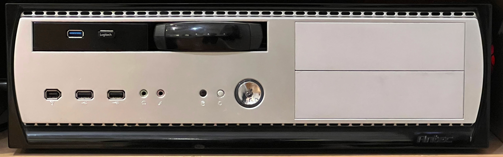
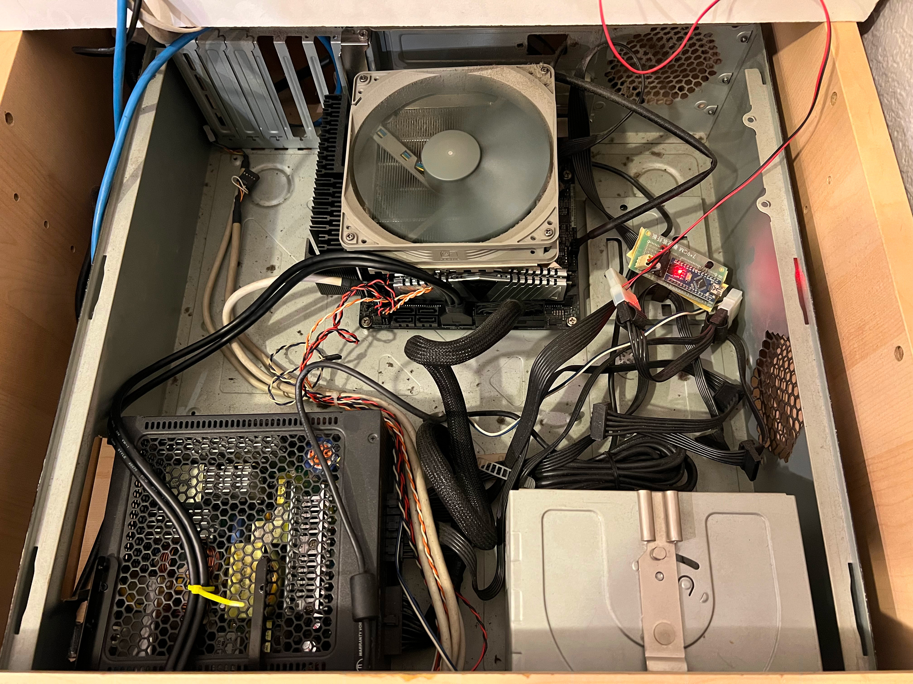

# exi

Used to be an HTPC with GPU for gaming and playing with k8s and, maybe, frigate.
Now it is a video editing workstation.

## Hardware

Item|Description
----|----------
CPU|Intel Core i5-12400F Alder Lake 6C 12T 2.5GHz LGA1700 65W BX8071512400F
CPU Cooler|Cooler Master Hyper 212 EVO
CPU Fan|PWM 120x120x25 mm, 650-1800 rpm
Motherboard|ASRock B760M PRO RS LGA1700 MicroATX
RAM|Team Elite 16GB (2 x 8GB) DDR5 5200 (PC5 41600) TED516G5200C42DC016, 42-42-42-84 1.10V
M.2_0|Key E, supports type 2230 WiFi/BT PCIe WiFi module and Intel® CNVio/CNVio2
&nbsp;|Intel WiFi6 AX201 Bt 5.2
M.2_1|Key M, supports type 2242/2260/2280 PCIe Gen4x4 (64 Gb/s)
&nbsp;|500GB WD Blue SN550 NVMe SSD - Gen3x4 PCIe 8Gb/s, M.2 2280, 3D NAND WDS500G2B0C
M.2_2|Key M, supports type 2280 PCIe Gen4x4 (64 Gb/s)
&nbsp;|[Edge TPU ML compute accelerator, Coral TPU M.2 B+M](../coral.html)
M.2_3|Key M, supports type 2280 PCIe Gen4x4 (64 Gb/s)
SATA|4 x SATA3 6.0 Gb/s Connectors
PCIe1|PCIe 5.0 x16 slot, supports x16 mode
&nbsp;|MSI Ventus GeForce RTX 3050 8GB GDDR6 PCIx 4.0 x8, HDMI 2.1, DP v1.4a 115W
PCIe2|PCIe 3.0 x16 slot, supports x4 mode
&nbsp;|[1xPCIe to 4xSATA M.2 adapter](../1xPCIe-4xSATA-M.2.html)
Ethernet|onboard RTL8125BG
BIOS|3.04
Case|Antec
PSU|SeaSonic SS-400FL2 Active PFC F3 400W 80 PLUS Platinum Fanless ATX12V / EPS12V
OS|Ubuntu Studio 23.10
Monitor|Samsung QN75Q80TAFXZA
Speakers|SAMSUNG HW-Q950T 9.1.4 Soundbar + Sub + Surrounds

* [DMI Info](dmi.html)
* [PCIe Devices](lspci.html)

<p align="center" width="100%">
    
    
</p>

## USB

```
alex@exi > lsusb
Bus 002 Device 002: ID 174c:3074 ASMedia Technology Inc. ASM1074 SuperSpeed hub
Bus 002 Device 001: ID 1d6b:0003 Linux Foundation 3.0 root hub
Bus 001 Device 004: ID a604:0715 2.4G Composite Devic Wireless Devic
Bus 001 Device 003: ID 046d:c548 Logitech, Inc. Logi Bolt Receiver
Bus 001 Device 002: ID 174c:2074 ASMedia Technology Inc. ASM1074 High-Speed hub
Bus 001 Device 006: ID 8087:0026 Intel Corp. AX201 Bluetooth
Bus 001 Device 005: ID 26ce:01a2 ASRock LED Controller
Bus 001 Device 001: ID 1d6b:0002 Linux Foundation 2.0 root hub
```

## Power Consumption

* when turned off - 2W!
* qhile serving a single video stream over SMB and with CPU consumption <4%: 88W
