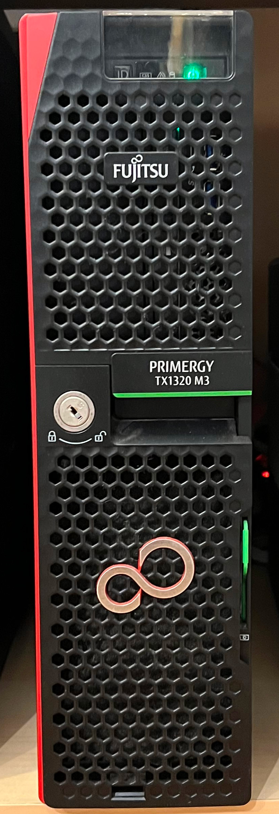
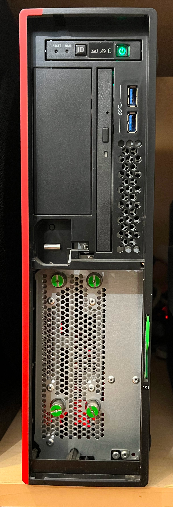
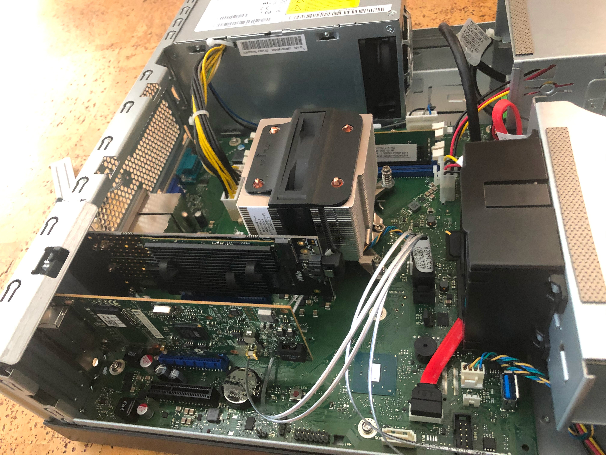
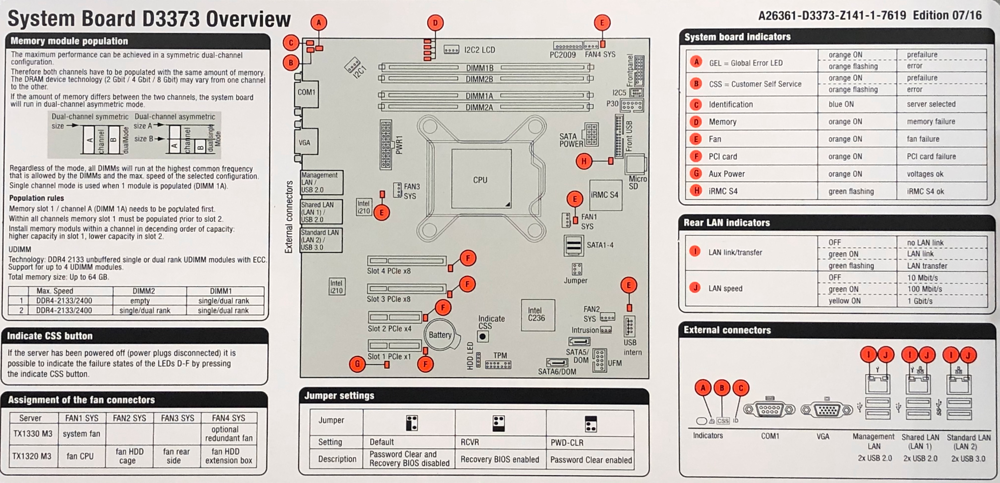

# fuji

Fujitsu PRIMERGY TX1320 M3 PYT1323T3S

Item|Description
----|----------
CPU|Xeon E3-1230v6 3.5Ghz 4C/8T 8MB 72W
Motherboard|D3373-B1x, Intel C236 chipset, 2x PCIx3 8-lane x2, 1x PCIx3 1-lane, 1 PCIx3 4-lane
RAM|UDIMM PC4-19200 unbuffered ECC DDR4-2400MHz, 4 slots, Max64GB
.|2x DDR4 ECC UDIMM 16GB 2Rx8 2666 CL19 MTA18ASF2G72AZ-2G6E2
.|16 GB 18ASF2G72AZ-2G6E2, 2667 MT/s, @2400 MT/s
.|16 GB 18ASF2G72AZ-2G6E2, 2667 MT/s, @2400 MT/s
M2 Adapter|PCIE Adapter for SATA or PCIE NVMe SSD
.|M.2 2280 Nvme PCIe SSD Sabrent 256GB Rocket SB-ROCKET-256
.|M.2 2280 SATA SSD Samsung 860 EVO 500GB MZ-N6E500BW
Storage Controller|onboard 4ports SATA 6G
Ethernet|onboard 2x i210
.|Dell Intel I350-T2 Dual Port 1GBE Network Card XP0NY
PSU|250W
UPS|APC RS1000G
OS|ProxMox VE

<p align="center" width="100%">
    
    
    
    
    
</p>

## PCI

```
root@fuji:~# lspci
00:00.0 Host bridge: Intel Corporation Xeon E3-1200 v6/7th Gen Core Processor Host Bridge/DRAM Registers (rev 05)
00:01.0 PCI bridge: Intel Corporation 6th-10th Gen Core Processor PCIe Controller (x16) (rev 05)
00:14.0 USB controller: Intel Corporation 100 Series/C230 Series Chipset Family USB 3.0 xHCI Controller (rev 31)
00:14.2 Signal processing controller: Intel Corporation 100 Series/C230 Series Chipset Family Thermal Subsystem (rev 31)
00:16.0 Communication controller: Intel Corporation 100 Series/C230 Series Chipset Family MEI Controller #1 (rev 31)
00:16.1 Communication controller: Intel Corporation 100 Series/C230 Series Chipset Family MEI Controller #2 (rev 31)
00:17.0 SATA controller: Intel Corporation Q170/Q150/B150/H170/H110/Z170/CM236 Chipset SATA Controller [AHCI Mode] (rev 31)
00:1c.0 PCI bridge: Intel Corporation 100 Series/C230 Series Chipset Family PCI Express Root Port #5 (rev f1)
00:1c.5 PCI bridge: Intel Corporation 100 Series/C230 Series Chipset Family PCI Express Root Port #6 (rev f1)
00:1c.6 PCI bridge: Intel Corporation 100 Series/C230 Series Chipset Family PCI Express Root Port #7 (rev f1)
00:1d.0 PCI bridge: Intel Corporation 100 Series/C230 Series Chipset Family PCI Express Root Port #9 (rev f1)
00:1f.0 ISA bridge: Intel Corporation C236 Chipset LPC/eSPI Controller (rev 31)
00:1f.2 Memory controller: Intel Corporation 100 Series/C230 Series Chipset Family Power Management Controller (rev 31)
00:1f.4 SMBus: Intel Corporation 100 Series/C230 Series Chipset Family SMBus (rev 31)
01:00.0 Non-Volatile memory controller: Phison Electronics Corporation E12 NVMe Controller (rev 01)
02:00.0 VGA compatible controller: Matrox Electronics Systems Ltd. MGA G200e [Pilot] ServerEngines (SEP1) (rev 05)
02:00.1 Co-processor: Emulex Corporation ServerView iRMC HTI
03:00.0 Ethernet controller: Intel Corporation I210 Gigabit Network Connection (rev 03)
04:00.0 Ethernet controller: Intel Corporation I210 Gigabit Network Connection (rev 03)
05:00.0 Ethernet controller: Intel Corporation I350 Gigabit Network Connection (rev 01)
05:00.1 Ethernet controller: Intel Corporation I350 Gigabit Network Connection (rev 01)
```

## USB

```
root@fuji:~# lsusb
Bus 002 Device 001: ID 1d6b:0003 Linux Foundation 3.0 root hub
Bus 001 Device 002: ID 051d:0002 American Power Conversion Uninterruptible Power Supply
Bus 001 Device 001: ID 1d6b:0002 Linux Foundation 2.0 root hub
```

## VMs

pfSense

hass

```
root@fuji:~# cat /etc/pve/.vmlist|jq --sort-keys
{
  "ids": {
    "100": {
      "node": "fuji",
      "type": "lxc",
      "version": 11
    },
    "1000": {
      "node": "fuji",
      "type": "lxc",
      "version": 8
    },
    "1001": {
      "node": "fuji",
      "type": "lxc",
      "version": 12
    },
    "1003": {
      "node": "fuji",
      "type": "lxc",
      "version": 7
    },
    "1004": {
      "node": "fuji",
      "type": "lxc",
      "version": 5
    },
    "1005": {
      "node": "fuji",
      "type": "lxc",
      "version": 6
    },
    "101": {
      "node": "fuji",
      "type": "qemu",
      "version": 14
    },
    "102": {
      "node": "fuji",
      "type": "lxc",
      "version": 9
    },
    "103": {
      "node": "fuji",
      "type": "lxc",
      "version": 10
    },
    "104": {
      "node": "fuji",
      "type": "qemu",
      "version": 19
    },
    "200": {
      "node": "fuji",
      "type": "qemu",
      "version": 4
    },
    "300": {
      "node": "fuji",
      "type": "qemu",
      "version": 3
    }
  },
  "version": 8
}
```

```
root@fuji:~# ls -la /etc/pve/nodes/fuji/qemu-server/
total 2
drwxr-xr-x 2 root www-data   0 Feb  9  2020 .
drwxr-xr-x 2 root www-data   0 Feb  9  2020 ..
-rw-r----- 1 root www-data 549 Mar  4 10:58 101.conf
-rw-r----- 1 root www-data 497 Mar  5 12:17 104.conf
-rw-r----- 1 root www-data 505 Oct 18  2020 200.conf
-rw-r----- 1 root www-data 518 Nov 12  2020 300.conf
```
