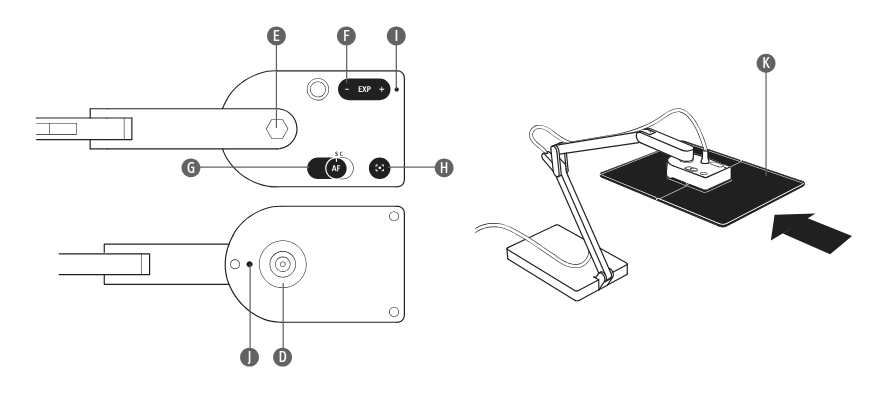

# IPEVO Ziggi-HD Plus Document Camera

This is just a USB webcam with a stand to point at the document on your table.

## Hardware

Letter|Item|Description
------|----|-----------
D|Camera lens|8.0 Megapixel lens. Resolution up to 3264 x 2448 with. Automatic Macro mode for maintaining a sharp focus on objects as close as 3.94 inches (10 cm) away.
E|Swivel head|You can swivel the camera. 270° of swivel is possible – 180° clockwise and 90° counterclockwise.
F|EXP +/-|Exposure Value. Increase or decrease artificial exposure of the image, making it brighter (+) or darker (-).
G|Autofocus (AF) switch|Continuous (C) causes Ziggi-HD Plus to constantly determine the best focus for your image. Single (S) causes Ziggi-HD Plus to stay at a single focus.
H|Focus button|In Single focus mode, press this button for sharp focus of your subject. It only takes a few seconds for Ziggi-HD Plus to determine and set proper focus.
I|Camera indicator|Indicates whether camera is operating: white for operating, off for not. When you start the Presenter software, the Camera indicator will light up.
J|Microphone|A built-in microphone which can be used to capture your voice for video conferencing sessions and other applications.
K|Anti-Glare Shield|If you are experiencing glare in your video capture, consider mounting the Anti-Glare Shield onto the camera.

<p align="center" width="100%">
    
</p>


## Identify the device

See also [Troubleshoot USB Webcam in Linux](../usb-video.html).

```
alex@duo > v4l2-ctl --list-devices
IPEVO Ziggi-HD Plus (usb-0000:00:14.0-10):
	/dev/video0
	/dev/video1
	/dev/media0

ILCE-7M4 (usb-0000:00:14.0-3):
	/dev/video2
	/dev/video3
	/dev/media1

EMEET SmartCam S800: EMEET Smar (usb-0000:00:14.0-5):
	/dev/video4
	/dev/video5
	/dev/media2
```

## Camera Capabilities
```
alex@duo > v4l2-ctl --all --device /dev/video0
Driver Info:
	Driver name      : uvcvideo
	Card type        : IPEVO Ziggi-HD Plus
	Bus info         : usb-0000:00:14.0-10
	Driver version   : 6.8.12
	Capabilities     : 0x84a00001
		Video Capture
		Metadata Capture
		Streaming
		Extended Pix Format
		Device Capabilities
	Device Caps      : 0x04200001
		Video Capture
		Streaming
		Extended Pix Format
Media Driver Info:
	Driver name      : uvcvideo
	Model            : IPEVO Ziggi-HD Plus
	Serial           :
	Bus info         : usb-0000:00:14.0-10
	Media version    : 6.8.12
	Hardware revision: 0x00000803 (2051)
	Driver version   : 6.8.12
Interface Info:
	ID               : 0x03000002
	Type             : V4L Video
Entity Info:
	ID               : 0x00000001 (1)
	Name             : IPEVO Ziggi-HD Plus
	Function         : V4L2 I/O
	Flags            : default
	Pad 0x01000007   : 0: Sink
	  Link 0x02000019: from remote pad 0x100000a of entity 'Extension 8' (Video Pixel Formatter): Data, Enabled, Immutable
Priority: 2
Video input : 0 (Camera 1: ok)
Format Video Capture:
	Width/Height      : 640/480
	Pixel Format      : 'YUYV' (YUYV 4:2:2)
	Field             : None
	Bytes per Line    : 1280
	Size Image        : 614400
	Colorspace        : sRGB
	Transfer Function : Rec. 709
	YCbCr/HSV Encoding: ITU-R 601
	Quantization      : Default (maps to Limited Range)
	Flags             :
Crop Capability Video Capture:
	Bounds      : Left 0, Top 0, Width 640, Height 480
	Default     : Left 0, Top 0, Width 640, Height 480
	Pixel Aspect: 1/1
Selection Video Capture: crop_default, Left 0, Top 0, Width 640, Height 480, Flags:
Selection Video Capture: crop_bounds, Left 0, Top 0, Width 640, Height 480, Flags:
Streaming Parameters Video Capture:
	Capabilities     : timeperframe
	Frames per second: 30.000 (30/1)
	Read buffers     : 0

User Controls

                     brightness 0x00980900 (int)    : min=-64 max=64 step=1 default=0 value=0
                       contrast 0x00980901 (int)    : min=0 max=95 step=1 default=0 value=0
                     saturation 0x00980902 (int)    : min=0 max=100 step=1 default=64 value=64
                            hue 0x00980903 (int)    : min=-2000 max=2000 step=1 default=0 value=0
        white_balance_automatic 0x0098090c (bool)   : default=1 value=0
                          gamma 0x00980910 (int)    : min=100 max=300 step=1 default=100 value=100
           power_line_frequency 0x00980918 (menu)   : min=0 max=2 default=2 value=2 (60 Hz)
				0: Disabled
				1: 50 Hz
				2: 60 Hz
      white_balance_temperature 0x0098091a (int)    : min=2200 max=7500 step=10 default=4600 value=3400
                      sharpness 0x0098091b (int)    : min=1 max=7 step=1 default=2 value=2
         backlight_compensation 0x0098091c (int)    : min=0 max=3 step=1 default=3 value=3

Camera Controls

                 focus_absolute 0x009a090a (int)    : min=35 max=190 step=1 default=120 value=95 flags=inactive
     focus_automatic_continuous 0x009a090c (bool)   : default=1 value=1

alex@duo > v4l2-ctl --list-formats-ext --device /dev/video0
ioctl: VIDIOC_ENUM_FMT
	Type: Video Capture

	[0]: 'MJPG' (Motion-JPEG, compressed)
		Size: Discrete 640x480
			Interval: Discrete 0.033s (30.000 fps)
		Size: Discrete 800x600
			Interval: Discrete 0.033s (30.000 fps)
		Size: Discrete 1024x768
			Interval: Discrete 0.033s (30.000 fps)
		Size: Discrete 1280x720
			Interval: Discrete 0.033s (30.000 fps)
		Size: Discrete 1600x1200
			Interval: Discrete 0.033s (30.000 fps)
		Size: Discrete 1920x1080
			Interval: Discrete 0.033s (30.000 fps)
		Size: Discrete 2048x1536
			Interval: Discrete 0.067s (15.000 fps)
		Size: Discrete 2592x1944
			Interval: Discrete 0.067s (15.000 fps)
		Size: Discrete 3264x1836
			Interval: Discrete 0.067s (15.000 fps)
		Size: Discrete 3264x2448
			Interval: Discrete 0.067s (15.000 fps)
	[1]: 'YUYV' (YUYV 4:2:2)
		Size: Discrete 640x480
			Interval: Discrete 0.033s (30.000 fps)
		Size: Discrete 800x600
			Interval: Discrete 0.040s (25.000 fps)
		Size: Discrete 1024x768
			Interval: Discrete 0.067s (15.000 fps)
		Size: Discrete 1280x720
			Interval: Discrete 0.100s (10.000 fps)
		Size: Discrete 1600x1200
			Interval: Discrete 0.143s (7.000 fps)
		Size: Discrete 1920x1080
			Interval: Discrete 0.200s (5.000 fps)
alex@duo > v4l2-ctl --list-formats-ext --device /dev/video1
ioctl: VIDIOC_ENUM_FMT
	Type: Video Capture
```

## Live View

For the best uncompressed quality in 16:9:
```sh
vlc --meta-title='Live Document Feed' \
    --meta-description='Straight from my desk' \
    'v4l2:///dev/video0:width=1920:height=1080:fps=5:chroma=YUYV'
```

For the best uncompressed quality in 4:3:
```sh
vlc --meta-title='Live Document Feed' \
    --meta-description='Straight from my desk' \
    'v4l2:///dev/video0:width=1600:height=1200:fps=7:chroma=YUYV'
```

For best quality with compression in 4:3:
```sh
vlc --meta-title='Live Document Feed' \
    --meta-description='Straight from my desk' \
    'v4l2:///dev/video0:width=3264:height=2448:fps=15:chroma=MJPG:white_balance_automatic=0:white_balance_temperature=6000'
```

For best quality with compression in 16:9:
```sh
vlc --meta-title='Live Document Feed' \
    --meta-description='Straight from my desk' \
    'v4l2:///dev/video0:width=3264:height=1836:fps=15:chroma=MJPG'
```
