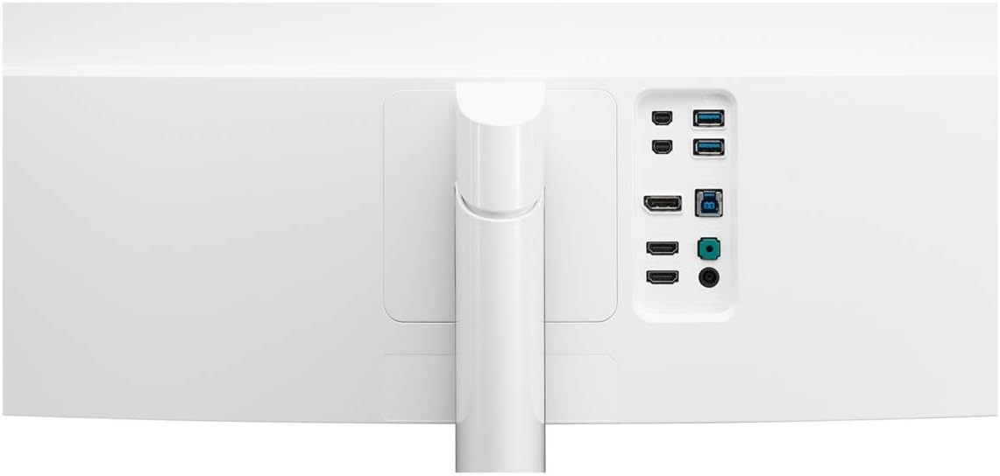
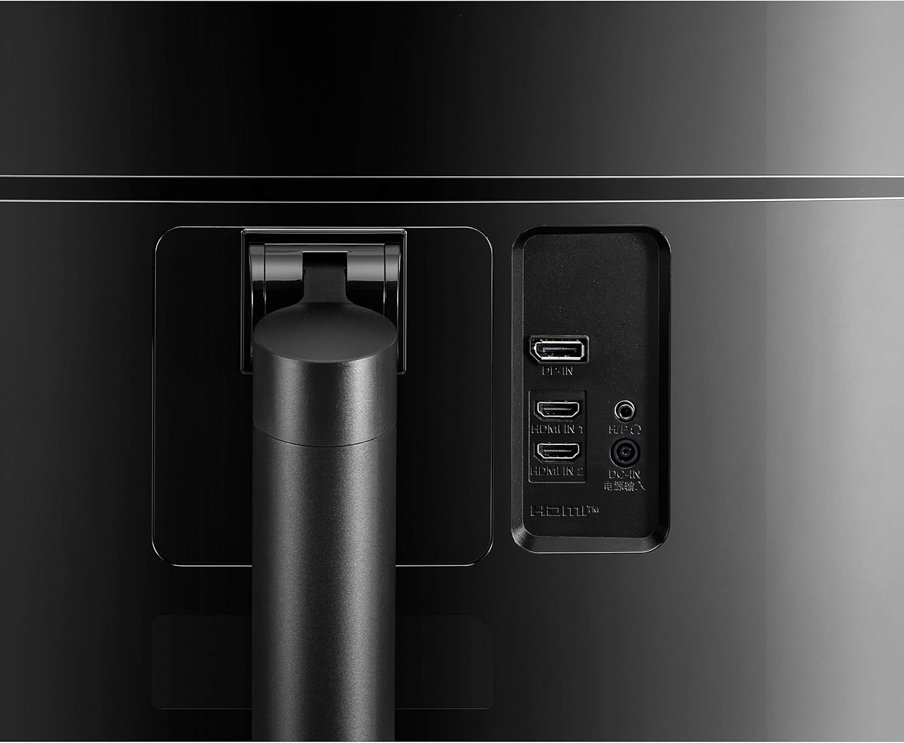

# LG Monitors

* Barbara's [34UC98-W](https://www.amazon.com/dp/B019O78DPS) 34" 21:9 Curved WQHD IPS, 3440x1440, FreeSync, Thunderbolt 2.0, MaxxAudio 7Wx2, 56.7W PS

* Mine [38WN75C-B](https://www.amazon.com/dp/B087YZG5YS) 38" 21:9 Curved UltraWide QHD+ OPs, 3840x1600, HDR 10, FreeSync, upto 65W

* [27US500](https://www.amazon.it/dp/B0DH51BPZD) 27" 4K, IPS, 3840x2160, HDR 10, DCI-P3 90%, 60Hz, 5ms (GtG), FreeSync, HDMI 2.0

