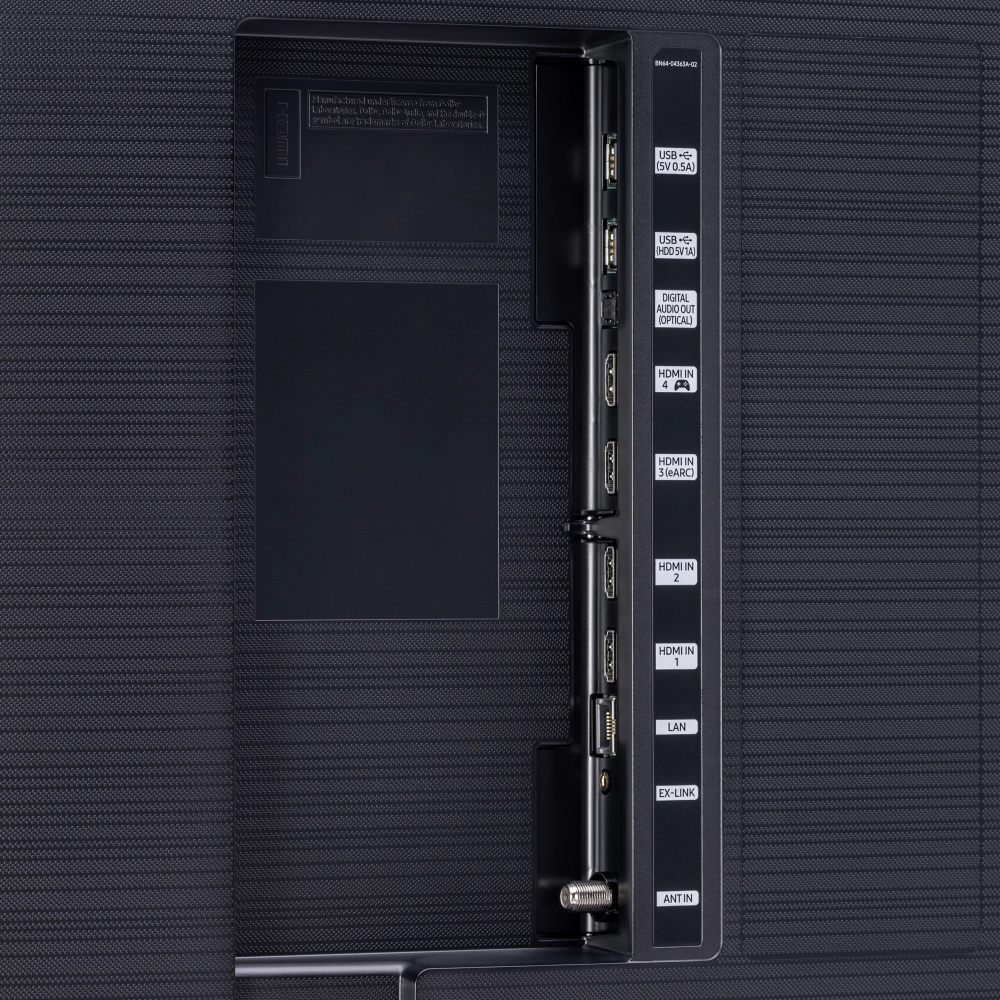
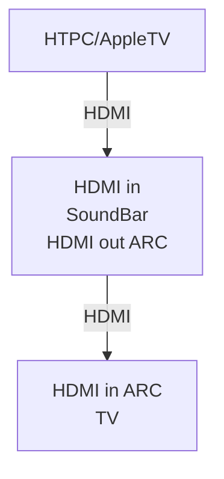

# Samsung TV and Soundbar

## TV

[Samsung 75" Q80T QLED 4K UHD HDR Smart TV (2020) QN75Q80TAFXZA](https://www.samsung.com/us/tvs/qled-tv/q80t-75-inch-qled-4k-smart-tv-qn75q80tafxza/)
* [specs](https://www.samsung.com/us/tvs/qled-tv/q80t-75-inch-qled-4k-smart-tv-qn75q80tafxza/#specs)
* [manual](https://downloadcenter.samsung.com/content/UM/202401/20240111154014045/NIKDVBADT-3.3.0_EM_NIKE_ASIA_ENG_230626.0.pdf)


## Soundbar

[Samsung 9.1 soundbar HW-Q950T/ZA with 4K/HDR pass-through](https://www.samsung.com/au/audio-devices/soundbar/9-1-4-ch-soundbar-dolby-atmos-black-hw-q950t-xy/)
* [manual](https://downloadcenter.samsung.com/content/UM/202008/20200810142923234/AH81-13332R-00_FM_HW-Q950T_XL_XS_XM_XY_XP_ENG_200728.pdf)

## Connectivity

[Connect](https://www.samsung.com/us/support/answer/ANS00049272/) your video
source, soundbar and TV using HDMI:

```
+---------------+
| HTPC/AppleTV  |
+----o----------+
     |
    HDMI
     |
    \./
+----o----------+
| HDMIin        |
|               |
| SoundBar      |
|               |
| HDMIout ARC   |
+----o----------+
     |
    HDMI
     |
    \./
+----o----------+
| HDMIin ARC    |
|               |
| TV            |
|               |
+---------------+
```



* Enable HDMI-CEC settings on your AppleTV.
* Enable Anynet+ on the soundbar.  This will make the soundbar turn on
automatically when you turn on the connected external device.
* Enable Anynet+ (HDMI-CEC) on the TV.  This will make the TV turn on when the
the soundbar is turned on
