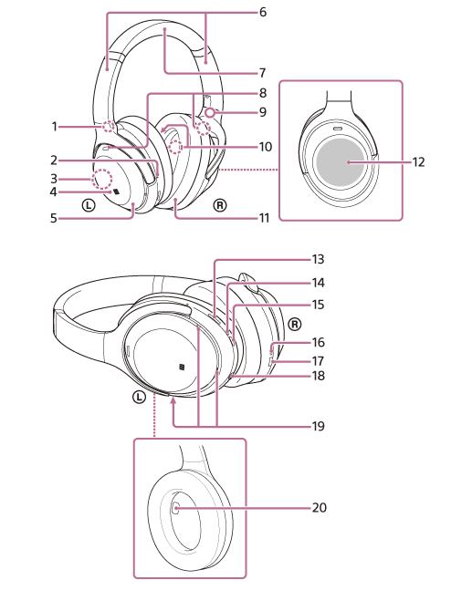

# Sony WH-1000XM4 Wireless Noise Canceling Headphones

From [suport page](https://www.sony.com/electronics/support/wireless-headphones-bluetooth-headphones/wh-1000xm4):

* [specification](https://www.sony.com/electronics/support/wireless-headphones-bluetooth-headphones/wh-1000xm4/specifications)
* [web manual](https://helpguide.sony.net/mdr/wh1000xm4/v1/en/index.html)
* [short user guide](https://www.sony.com/electronics/support/res/manuals/5013/06a4500310182e23e0b94878ccc5a627/50137281M.pdf)
* [reference guide](https://www.sony.com/electronics/support/res/manuals/5013/7a1c732322d3c78eb55467c8e16d369c/50137291M.pdf)

App: "Sony | Sound Connect”, formerly "Sony | Headphones Connect”.

## Controls

1. (left) mark
2. Tactile dot. There is a tactile dot on the left unit.
3. Built-in antenna. A Bluetooth antenna is built into the headset.
4. N-Mark
5. Left unit
6. Sliders (left, right). Slide to adjust the length of the headband.
7. Headband
8. Noise canceling function microphones (external) (left, right). Pick up the sound of the noise when the noise canceling function is in use.
9. (right) mark
10. Noise canceling function microphones (internal) (left, right). Pick up the sound of the noise when the noise canceling function is in use.
11. Right unit
12. Touch sensor control panel.  Remotely controls music playback of the connected Bluetooth device or performs other operations using touch operation.
13. CUSTOM button.  Operate when switching the noise canceling function and Ambient Sound Mode, etc.
14. Indicator (red/blue). Lights up in red or blue to indicate the power or communication status of the headset.
15. (power) button
16. Charging indicator (red).  Lights up in red while charging.
17. USB Type-C port.  Connect the headset to an AC outlet via a commercially available USB AC adaptor or to a computer with the supplied USB Type-C cable to charge the headset.
18. Headphone cable input jack.  Connect a music player, etc. using the supplied headphone cable. Make sure that you insert the cable until it clicks. If the plug is not connected correctly, you may not hear the sound properly.
19. Voice pickup microphones.  Pick up the sound of your voice when talking on the phone or in the Speak-to-Chat mode.
20. Proximity sensor.  Detects whether the headset is worn on the ears.

## Buttons

* Ambient Sound: AS
* Noise Canceling: NC

Button|Short Press|Press (2 sec)|Long Press (7 secs)
------|-----------|-------------|-------------------
Power |Voice feedback charge level| Power Up/Down|Pair
Custom|Rotate: AS:ON - AS:OFF/NC:OFF - NC:ON|Start NC Optimizer

## LED

Blink|Description
-----|-----------
Double Blue|Pairing
Solid Blue|On
Red|Discharged

## Gestures

Gesture|Description
-------|-----------
Double tap|call pick up/down, play/pause
Swipe up/down|volume up/down
Swipe right/left and release|track next/prev
Swipe right/left and hold|fast forward/reverse
Touch the entire touch sensor|Quick Attention Mode
2-finger touch|Speak-to-Chat

## Sony | Sound Connect app

Formerly "Sony | Headphones Connect”.  Use it.
