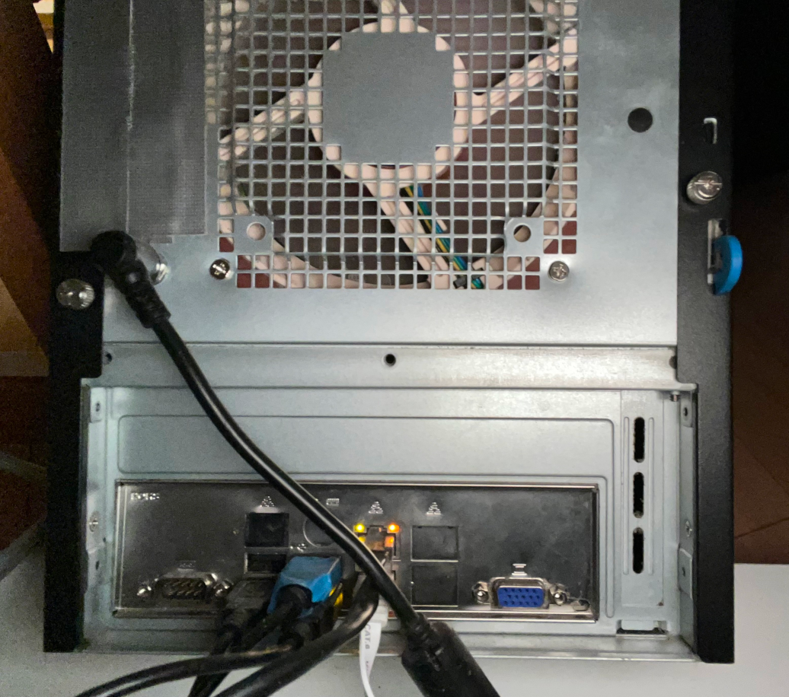

# suprox all-in-one home server

A single-home-server solution.  Runs these VMs and containers:

* virtualized pfSense - no NIC passthrough;
* virtualized TrueNas - HDs, not HBA, passed through;
* virtualized haos (home assistant);

and LXC containers:

* unified controller
* octoprint
* dynamo
* mqtt
* vault

in docker containers:

* portainer
* mjpg-streamer for use by octoprint

## Hardware

[dmi info](dmi.html)

Item|Description
----|----------
CPU|Intel [i3-8100](https://ark.intel.com/content/www/us/en/ark/products/126688/intel-core-i3-8100-processor-6m-cache-3-60-ghz.html) 4C/4T 3.6 GHz LGA1151 65W BX80684I38100 Coffee Lake
Motherboard|Supermicro [X11SCL-IF](https://www.supermicro.com/en/products/motherboard/x11scl-if) miniITX LGA1151 C242
BMC|ASpeed AST 2500
BIOS|1.5 10/5/2020
BMC f/w|1.23.06
RAM|Crucial 16GB (2x8GB) 288-Pin DDR4 2666 MT/s PC4-21300 - CT2K8G4DFS8266
SSD|500GB WD Blue SN550 NVMe SSD, Gen3x4 PCIe 8Gb/s, M.2 2280, 2,400 MB/s, WDS500G2B0C
NIC|2x Intel I210 on motherboard
NIC|Intel i350-T2
PSU|Mini Box PicoPSU-150-XT 12V DC-DC ATX
.|Mini Box 10A 120W 110-240V AC to 12V DC PicoPSU Compatible
Case|Supermicro SuperChassis [721TQ-350B2](https://www.supermicro.com/en/products/chassis/Compact%20Mini-Tower/721/SC721TQ-350B2)
Case fan|Noctua [NF-A12x25 LS-PWM](https://noctua.at/en/nf-a12x25-pwm), Ultra Quiet Silent Fan, 4-Pin, 120mm, Brown
/dev/sda|WDC WD60EFZX-68B3FN0
/dev/sdb|WDC WD60EFRX-68L0BN1

<p align="center" width="100%">
    
    
</p>


## PCI Devices

```
root@suprox:~# lspci
00:00.0 Host bridge: Intel Corporation 8th Gen Core 4-core Desktop Processor Host Bridge/DRAM Registers [Coffee Lake S] (rev 08)
00:01.0 PCI bridge: Intel Corporation 6th-10th Gen Core Processor PCIe Controller (x16) (rev 08)
00:08.0 System peripheral: Intel Corporation Xeon E3-1200 v5/v6 / E3-1500 v5 / 6th/7th/8th Gen Core Processor Gaussian Mixture Model
00:12.0 Signal processing controller: Intel Corporation Cannon Lake PCH Thermal Controller (rev 10)
00:14.0 USB controller: Intel Corporation Cannon Lake PCH USB 3.1 xHCI Host Controller (rev 10)
00:14.2 RAM memory: Intel Corporation Cannon Lake PCH Shared SRAM (rev 10)
00:15.0 Serial bus controller: Intel Corporation Cannon Lake PCH Serial IO I2C Controller #0 (rev 10)
00:15.1 Serial bus controller: Intel Corporation Cannon Lake PCH Serial IO I2C Controller #1 (rev 10)
00:16.0 Communication controller: Intel Corporation Cannon Lake PCH HECI Controller (rev 10)
00:16.4 Communication controller: Intel Corporation Cannon Lake PCH HECI Controller #2 (rev 10)
00:17.0 SATA controller: Intel Corporation Cannon Lake PCH SATA AHCI Controller (rev 10)
00:1b.0 PCI bridge: Intel Corporation Cannon Lake PCH PCI Express Root Port #22 (rev f0)
00:1b.6 PCI bridge: Intel Corporation Cannon Lake PCH PCI Express Root Port #23 (rev f0)
00:1c.0 PCI bridge: Intel Corporation Cannon Lake PCH PCI Express Root Port #1 (rev f0)
00:1c.1 PCI bridge: Intel Corporation Cannon Lake PCH PCI Express Root Port #2 (rev f0)
00:1d.0 PCI bridge: Intel Corporation Cannon Lake PCH PCI Express Root Port #9 (rev f0)
00:1e.0 Communication controller: Intel Corporation Cannon Lake PCH Serial IO UART Host Controller (rev 10)
00:1f.0 ISA bridge: Intel Corporation Device a30a (rev 10)
00:1f.4 SMBus: Intel Corporation Cannon Lake PCH SMBus Controller (rev 10)
00:1f.5 Serial bus controller: Intel Corporation Cannon Lake PCH SPI Controller (rev 10)
01:00.0 Ethernet controller: Intel Corporation I350 Gigabit Network Connection (rev 01)
01:00.1 Ethernet controller: Intel Corporation I350 Gigabit Network Connection (rev 01)
02:00.0 Ethernet controller: Intel Corporation I210 Gigabit Network Connection (rev 03)
03:00.0 Ethernet controller: Intel Corporation I210 Gigabit Network Connection (rev 03)
05:00.0 PCI bridge: ASPEED Technology, Inc. AST1150 PCI-to-PCI Bridge (rev 04)
06:00.0 VGA compatible controller: ASPEED Technology, Inc. ASPEED Graphics Family (rev 41)
07:00.0 Non-Volatile memory controller: Sandisk Corp WD Blue SN550 NVMe SSD (rev 01)
```
## Storage Devices

Device|Serial
------|-------
/dev/sda|WDC WD60EFZX-68B3FN0
/dev/sdb|WDC WD60EFRX-68L0BN1


```
root@suprox:~# lsblk
NAME                         MAJ:MIN RM   SIZE RO TYPE MOUNTPOINTS
sda                            8:0    0   5.5T  0 disk
├─sda1                         8:1    0     2G  0 part
└─sda2                         8:2    0   5.5T  0 part
sdb                            8:16   0   5.5T  0 disk
├─sdb1                         8:17   0     2G  0 part
└─sdb2                         8:18   0   5.5T  0 part
nvme0n1                      259:0    0 465.8G  0 disk
├─nvme0n1p1                  259:1    0  1007K  0 part
├─nvme0n1p2                  259:2    0   512M  0 part /boot/efi
└─nvme0n1p3                  259:3    0 465.3G  0 part
  ├─pve-swap                 252:0    0     8G  0 lvm  [SWAP]
  ├─pve-root                 252:1    0    96G  0 lvm  /
  ├─pve-data_tmeta           252:2    0   3.5G  0 lvm
  │ └─pve-data-tpool         252:4    0 338.4G  0 lvm
  │   ├─pve-data             252:5    0 338.4G  1 lvm
  │   ├─pve-vm--100--disk--0 252:6    0    32G  0 lvm
  │   ├─pve-vm--101--disk--0 252:7    0    32G  0 lvm
  │   ├─pve-vm--102--disk--0 252:8    0     8G  0 lvm
  │   ├─pve-vm--103--disk--0 252:9    0    32G  0 lvm
  │   ├─pve-vm--104--disk--0 252:10   0     8G  0 lvm
  │   ├─pve-vm--105--disk--0 252:11   0     2G  0 lvm
  │   ├─pve-vm--106--disk--0 252:12   0     4M  0 lvm
  │   ├─pve-vm--106--disk--1 252:13   0    32G  0 lvm
  │   └─pve-vm--107--disk--0 252:14   0     8G  0 lvm
  └─pve-data_tdata           252:3    0 338.4G  0 lvm
    └─pve-data-tpool         252:4    0 338.4G  0 lvm
      ├─pve-data             252:5    0 338.4G  1 lvm
      ├─pve-vm--100--disk--0 252:6    0    32G  0 lvm
      ├─pve-vm--101--disk--0 252:7    0    32G  0 lvm
      ├─pve-vm--102--disk--0 252:8    0     8G  0 lvm
      ├─pve-vm--103--disk--0 252:9    0    32G  0 lvm
      ├─pve-vm--104--disk--0 252:10   0     8G  0 lvm
      ├─pve-vm--105--disk--0 252:11   0     2G  0 lvm
      ├─pve-vm--106--disk--0 252:12   0     4M  0 lvm
      ├─pve-vm--106--disk--1 252:13   0    32G  0 lvm
      └─pve-vm--107--disk--0 252:14   0     8G  0 lvm
```

## USB Devices

```
root@suprox:/# lsusb
Bus 002 Device 001: ID 1d6b:0003 Linux Foundation 3.0 root hub
Bus 001 Device 004: ID 0c45:636b Microdia USB Live camera
Bus 001 Device 003: ID 2c99:0002 Prusa Original Prusa i3 MK3
Bus 001 Device 006: ID 0557:2419 ATEN International Co., Ltd
Bus 001 Device 005: ID 0557:7000 ATEN International Co., Ltd Hub
Bus 001 Device 002: ID 0764:0501 Cyber Power System, Inc. CP1500 AVR UPS
Bus 001 Device 001: ID 1d6b:0002 Linux Foundation 2.0 root hub
```

## OS - Proxmox

Virtualization server with VMs:

* pfSense
* NAS
* haos (home assistant)

and LXC containers:

* unicon
* octo
* dynamo
* mqtt
* vault

## Containers - Portainer

Besides, portainer, which runs as a container:

* mjpg-streamer

## VMs

### pfSense VM

```
root@suprox:/etc/pve/local/qemu-server# cat 100.conf
## pfSense VM
#
#http%3A//192.168.11.1
#
#Prometheus%3A http%3A//192.168.11.1%3A9100/metrics
agent: 1
balloon: 0
boot: order=scsi0;ide2;net0
cores: 2
cpu: kvm64,flags=+pdpe1gb;+aes
ide2: none,media=cdrom
machine: q35
memory: 12300
name: pfSense
net0: virtio=AA:46:00:E4:FF:18,bridge=vmbr0,queues=8
net1: virtio=DE:71:6E:21:A1:6B,bridge=vmbr1,queues=8
numa: 0
onboot: 1
ostype: other
scsi0: local-lvm:vm-100-disk-0,iothread=1,size=32G
scsihw: virtio-scsi-single
smbios1: uuid=a1ac928f-ec64-41ca-9f84-47f588b42b63
sockets: 1
startup: order=1
tablet: 0
vmgenid: 7ab697f0-2f53-42b9-81f7-a4ee25a106ff
```

### TrueNAS VM

```
root@suprox:/etc/pve/local/qemu-server# cat 101.conf
## TrueNAS VM
#
#http%3A//192.168.11.30/
agent: 1
balloon: 0
boot: order=scsi0;ide2;net0
cores: 2
cpu: kvm64,flags=+pdpe1gb;+aes
ide2: none,media=cdrom
machine: q35
memory: 16384
name: nas
net0: virtio=0E:5D:7E:B7:19:4D,bridge=vmbr0,queues=8
numa: 0
onboot: 1
ostype: l26
scsi0: local-lvm:vm-101-disk-0,iothread=1,size=32G
scsi3: /dev/disk/by-id/ata-WDC_WD60EFZX-68B3FN0_WD-C80TNK4G,iothread=1,serial=WD-C80TNK4G,size=5860522584K
scsi4: /dev/disk/by-id/ata-WDC_WD60EFRX-68L0BN1_WD-WX41D758NSVC,iothread=1,serial=WD-WX41D758NSVC,size=5860522584K
scsihw: virtio-scsi-single
smbios1: uuid=aa5ee900-1955-43b1-87bf-865730f6d47c
sockets: 1
startup: order=10
vmgenid: 64d3d2f8-2ce6-4f9c-8899-95145c5df810
```

### HAOS VM

```
root@suprox:/etc/pve/local/qemu-server# cat 106.conf
## Home Assistant OS VM
#
#http%3A//192.168.11.40%3A8123
agent: 1
bios: ovmf
boot: order=scsi0
cores: 2
efidisk0: local-lvm:vm-106-disk-0,efitype=4m,size=4M
localtime: 1
memory: 4096
meta: creation-qemu=7.0.0,ctime=1667527006
name: haos
net0: virtio=00:60:2F:F2:F7:29,bridge=vmbr0
onboot: 1
ostype: l26
scsi0: local-lvm:vm-106-disk-1,cache=writeback,discard=on,iothread=1,size=32G,ssd=1
scsihw: virtio-scsi-single
smbios1: uuid=0628e306-07b7-4e65-bb9d-7000f922c467
startup: order=500
tablet: 0
vmgenid: c7f96adb-c708-4810-ba6b-3e59214b03e1
```
