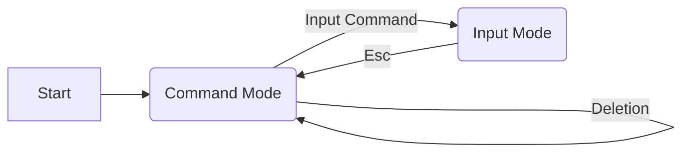

# vi cheat sheet

[vi in wikipedia](https://en.wikipedia.org/wiki/Vi),
[original article](https://docs.freebsd.org/44doc/usd/12.vi/paper.html).

## Command Line

|Command|Action
|-------|------
|vi _file_|edit _file_
|view _file_|view _file_
|vi -r _file_|view _file_
|vi -R _file_|view _file_
|vi + _file_|edit _file_, cursor at last line
|vi +_n_ _file_|edit _file_, cursor at line _n_

## Modes: Command & Input

vi starts in _command mode_. Navigation commands operate in _command mode_.
To switch to _input mode_ enter one of the input commands.
Once in _input mode_, any character you type is added to the file.
To exit the _input mode_, press the Esc key.

## Save, Exit

While in command mode...

Key|Action
---|------
:x|Save and exit
:q|Quit
:q!|Discard changes, quit
:e!|Discard changes since last save
:w|Save
:w!|Save, overwrite protection
:w _file_|Save as _file_
:wq|Save the file, exit vi

## Open

Key|Action
---|------
:e _file_|Open _file_ for editing
:e! _file_|Discard changes, open _file_ for editing

## Navigation

While in Command Mode...

Key|Action
---|------
H|Upper left corner (home)
M|Middle line
L|Lower left corner
h|Back a character
l|Forward a character
j|Down a line
k|Up a line
^|Beginning of line
$|End of line
w|One word forward
b|Back one word
G|go to the last line
 _n_ G|go to line _n_
: _n_|go to line _n_
Ctrl+G|display line

## Viewport

Key|Action
---|------
z [Enter]|Cursor at top
z.|Cursor in the middle
z-|Cursor at bottom

## Search & Replace

Key|Action
---|------
fc|Find c
;|Repeat find (find next c)
/ _pattern_ |Forward
/ |Repeat forward
? _pattern_|Reverse
? |Repeat reverse
n|Next occurrence in the direction of search
N|Prev occurrence in the direction of search
:g/_from_/s//_to_/g|Global replace

## Deletion Commands

While in command mMode...

Key|Action
---|------
dd|Delete a line
_n_ dd|Delete n lines
d)|Delete to end of sentence
db|Delete the previous word
D|Delete to the end of line
x|Delete a character

## Undo commands

Key|Action
---|------
u|Undo last change
U|Undo all changes on line

## Input Commands

These force transition to input mode.
To get back into command mode, press Esc.

Key|Action
---|------
i|Insert before
a|Insert after
I|Insert at the beginning of line
A|Insert at the end of line
o|Open line below
O|Open line above
:r _file_|Import a file
:12r _file_|Import a file at line 12
